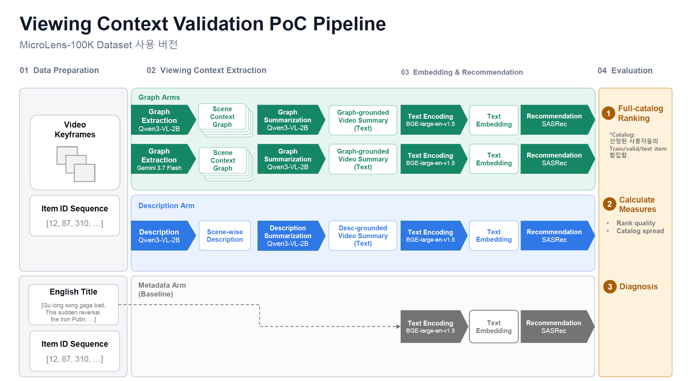

# ViewingContextPipeline

영상에서 추출한 시각 정보가 추천에 얼마나 유용한지 평가하는 연구용 PoC입니다. MicroLens-100K의 사용자 행동 이력을 바탕으로, **Title·Graph·Description 기반 item representation**을 SASRec에서 비교합니다.

## 파이프라인



| Arm                  | BGE 입력                       | Scene extractor  |
| -------------------- | ------------------------------ | ---------------- |
| Metadata · Baseline | Creator-written English title  | 없음             |
| Graph Qwen           | Graph 기반 video summary       | Qwen3-VL-2B      |
| Graph Gemini         | Graph 기반 video summary       | Gemini 3.7 Flash |
| Description          | Description 기반 video summary | Qwen3-VL-2B      |

영상은 기본 30초 구간마다 최대 6장의 keyframe으로 처리하고, Graph/Description을 Qwen으로 요약합니다. 모든 Arm은 frozen BGE embedding을 사용하며, 같은 사용자·item ID sequence·split·catalog와 동일한 SASRec 구조로 각각 학습합니다. **비교 대상은 각 ID에 연결되는 item representation**이며, 별도 ID embedding을 더하지 않습니다.

기본 v4 실험은 **사용자 100,000명·719,405개 interaction·19,738개 아이템 전체**를 보존합니다. 마지막 UTC 관측일을 제외한 직전 7일을 rolling 평가합니다. 공식 데이터에서는 2022-09-05~11이며, 7일 × 4 Arm × 3 seed = **84개 조합**을 독립적으로 epoch 선택·refit·평가합니다. 기존 v3 leave-two-out 결과는 별도 run에 보존됩니다. [전체 데이터 실행·검증 규칙](docs/full_rolling.md)을 참고하세요.

## 실행 준비

저장소를 내려받은 뒤 루트 디렉터리에서 실행합니다. Python 3.11+, `ffmpeg`·`ffprobe`, 로컬 Qwen/BGE checkpoint가 필요합니다. Qwen·BGE·SASRec은 Ubuntu/CUDA에서, Gemini API 호출은 Vertex ADC와 project 권한을 설정한 Windows VM에서 실행합니다.

```bash
conda create -n llmjg python=3.11 -y  # 새 환경이 필요한 경우
conda activate llmjg
python -m pip install -e ".[qwen,gemini,train,dev]"
```

Ubuntu의 Qwen 추론 의존성은 **`vllm==0.28.0`**입니다. 기존 vLLM 환경에서도 위 설치 후 `python -m pip check`로 의존성을 확인합니다. Windows VM에서 Gemini만 실행할 때는 `python -m pip install -e ".[gemini,dev]"`를 사용합니다. Windows에는 vLLM을 설치하거나 GPU 추론을 실행하지 않습니다.

데이터는 [공식 MicroLens portal](https://recsys.westlake.edu.cn/)에서 준비합니다.

- 사용자 사건: `MicroLens-100k_pairs.csv` (`user,item,timestamp`, timestamp는 정수 밀리초). TSV는 정합성 확인용입니다.
- 영상: item ID를 파일명으로 사용하는 `{item_id}.mp4`
- Title: `MicroLens-100k_title_en.csv`, 결측 보완용 `MicroLens-50k_titles.csv`

[config/pipeline.yaml](config/pipeline.yaml)의 다음 항목을 실행 환경에 맞게 수정합니다. 데이터와 모델은 자동 다운로드되지 않습니다.

| 설정                                    | 수정할 내용                                                   |
| --------------------------------------- | ------------------------------------------------------------- |
| `data.pairs_csv`, `data.pairs_tsv`, `data.videos_dir` | 원본 timestamp CSV, 정합성 확인 TSV, 영상 경로 |
| `data.titles_csv`                     | 아래에서 생성할`MicroLens-100k_title_en_completed.csv` 경로 |
| `models.qwen`, `models.bge`         | 로컬 checkpoint 디렉터리                                      |
| `models.gemini`                       | Vertex project ID, location, model ID                         |
| `extraction.visual_evidence`          | `scene_duration`: Scene 길이(초), `num_keyframes`: 완전한 Scene의 장수, `image_resolution`: 이미지 크기 |
| `extraction.qwen`                     | vLLM GPU당 메모리·동시 요청·토큰·전처리 예산. [설정과 측정 방법](docs/qwen_vllm.md) |
| `validation.cohort`                   | 전체 cardinality 100000/719405/19738, UTC·7일·최종일 제외 |

`protocol.sampling: fixed_windows`는 `scene_duration / num_keyframes` 길이의 구간별 중앙점을 추출합니다. 기본값 `scene_duration: 30`, `num_keyframes: 6`은 Scene 시작 기준 `[2.5, 7.5, 12.5, 17.5, 22.5, 27.5]`초입니다. 마지막 짧은 Scene은 같은 구간 간격을 유지하고 마지막 구간만 실제 영상 끝에서 잘라 중앙점을 구합니다(방식 A). 예를 들어 12초가 남으면 `[2.5, 7.5, 11]`초를 사용합니다. 영상 길이를 정수 초로 올리지 않습니다.

추출 시각은 영상 전체 기준이며 소수점 둘째 자리부터 버립니다(`1.666… → 1.6`). JSON과 추출 요청에 같은 시각을 사용하고, 이미지는 `data/resized_keyframes/{content_id}/0002_5.png`, 정수 초는 `0005.png` 형식으로 저장합니다. Scene 정보는 `data/cohort/source_assets/{content_id}/assets/timestamp_fixed_{scene_duration}s.json`에 저장합니다. 두 설정은 양의 정수이며, 0.1초 정밀도에서 구분할 수 있도록 `num_keyframes <= scene_duration × 10`이어야 합니다. 마지막 짧은 구간에서 버림 후 같은 시각이 생기면 한 번만 추출합니다. Graph Qwen·Graph Gemini·Description은 같은 이미지 목록을 사용합니다.

기존 run의 이미지를 재사용하려면 실행을 멈춘 상태에서 `data/fixed_30s/resized_keyframes/`를 `data/resized_keyframes/`로 옮깁니다(새 경로가 없을 때). 다른 Scene 길이의 run은 해당 `fixed_*s` 폴더를 사용합니다. timestamp JSON은 그대로 둡니다. 새 코드에는 이전 이미지 경로를 자동 탐색하거나 이동하는 동작이 없으며, 같은 run에서 서로 다른 sampling 결과를 이 폴더에 합치지 않습니다.

## 실행 방법

아래 Bash 명령은 Ubuntu 기준입니다. Windows에서 실행하는 Gemini 단계는 별도로 표시했습니다. 두 환경에서 **같은 run ID와 해당 run의 artifact·keyframe에 접근**할 수 있도록 경로를 준비합니다.

**1. 전체 입력 검사와 데이터 준비**

먼저 CSV 전체 사용자·사건·아이템 수와 rolling 분할을 검사하고 전체 item 목록을 만듭니다. 이 단계에서는 영상 처리나 모델 추론을 실행하지 않습니다.

```bash
export RUN_ID=microlens100k_rolling7_YYYYMMDD  # 새 실험을 구분할 고유 이름
python -m validation prepare-cohort --run-id "$RUN_ID" --plan-only
```

`artifacts/$RUN_ID/data/cohort/`의 `cohort_plan.json`과 `required_items.jsonl`을 확인합니다. 아래 도구는 원본 title을 보존하고, 필요한 item의 빈 title만 공식 50K 파일에서 보완합니다. `--output`은 앞서 설정한 `data.titles_csv`와 같아야 합니다.

```bash
ANNOTATIONS=/path/to/Annotations  # 다운로드한 title 파일 위치
python -m validation.complete_titles \
  --primary "$ANNOTATIONS/MicroLens-100k_title_en.csv" \
  --supplement "$ANNOTATIONS/MicroLens-50k_titles.csv" \
  --required-items "artifacts/$RUN_ID/data/cohort/required_items.jsonl" \
  --output "$ANNOTATIONS/MicroLens-100k_title_en_completed.csv" \
  --unresolved-policy zero-vector

python -m validation prepare-cohort --run-id "$RUN_ID"
python -m extraction prepare-input-data --run-id "$RUN_ID"
```

보완 후에도 없는 title은 `--unresolved-policy zero-vector`로 빈 필드를 유지하고 별도 기록합니다. v4의 `validation.cohort.metadata_missing_policy: zero_vector`에 따라 해당 아이템의 Metadata 입력은 1024차원 영벡터가 됩니다. 빈 문자열을 BGE에 보내지 않으며 아이템·interaction을 제거하지 않습니다. 정상 title과 Graph/Description 처리는 그대로입니다. 결측 목록은 `data/cohort/metadata_missing.json` 및 diagnosis의 `metadata_missing`에 기록됩니다.

v4의 `prepare-cohort`는 영상 존재·파일 크기·중복과 Title을 검사하며, ffprobe를 실행하지 않습니다. 영상이나 title CSV 자체·필수 아이템 행이 없으면 준비가 중단됩니다. `prepare-input-data`는 영상 4개를 병렬로 처리하면서 각 영상의 길이 조회 → Scene 계산 → resized keyframe 추출을 이어서 수행하고, 영상 단위 progress bar를 표시합니다.

조회한 길이는 `data/cohort/source_assets/{content_id}/assets/video_duration.json`에 바로 저장합니다. 같은 원본 경로·파일 크기·수정 시각이면 재실행 시 길이를 재사용하며, 기존 run의 inventory에 저장된 길이도 사용할 수 있습니다. 추출 실패 시 `preparation_failures.jsonl`을 확인한 뒤 같은 명령으로 재개하면 정상 keyframe과 저장된 길이는 재사용합니다. 원본 영상을 교체했다면 `prepare-cohort`로 파일 정보를 갱신해야 합니다. `prepare-input-data`가 완료되면 `data/cohort/media_preflight.json`에 전체 영상 길이·Scene·keyframe 수·저장공간 추정치를 저장합니다. v4 cohort의 `duration_seconds`는 `null`일 수 있으며, 이후 조회 결과는 catalog/inventory를 덮어쓰지 않고 별도 duration 파일에 저장됩니다.

**2. Graph·Description 추출과 요약**

Ubuntu/CUDA에서 Qwen branch를 실행합니다. `--gpus 1`은 사용할 visible GPU 개수이며, 생략해도 1개를 사용합니다. 각 GPU에 BF16 모델과 vLLM 엔진을 하나씩 올립니다. 여러 영상의 독립적인 장면·요약 요청을 continuous batching으로 처리하며, 장면별 keyframe을 다른 장면의 프롬프트와 합치지 않습니다. 선택한 GPU는 이 명령에 전용으로 할당합니다.

```bash
python -m extraction extract-graph-scenes --model qwen --run-id "$RUN_ID" --gpus 1
python -m extraction summarize-graph --source qwen --run-id "$RUN_ID" --gpus 1
python -m extraction extract-description-scenes --run-id "$RUN_ID" --gpus 1
python -m extraction summarize-description --run-id "$RUN_ID" --gpus 1
```

Gemini Graph 추출은 Windows/PowerShell에서 같은 run ID로 실행합니다.

```powershell
conda activate llmjg
$RUN_ID = "microlens100k_rolling7_YYYYMMDD"  # Ubuntu에서 사용한 값과 동일하게 지정
python -m extraction extract-graph-scenes --model gemini --run-id $RUN_ID
```

Gemini Graph 산출물을 Ubuntu의 같은 run에서 사용할 수 있는지 확인한 뒤, Qwen으로 요약합니다.

```bash
python -m extraction summarize-graph --source gemini --run-id "$RUN_ID" --gpus 1
```

엔진 전환 후에도 같은 run ID로 기존 명령을 실행하면 정상 산출물을 재사용하고 실패·누락 작업을 이어서 처리합니다. 기존 검증에서 비호환으로 판단한 결과의 처리와 `--force` 의미는 유지합니다. `extraction/qwen_runtime.jsonl`에 GPU·라이브러리 버전·적용 설정과 새 저장 결과의 해시를 기록하고, 대응 이력이 없는 기존 결과는 시작 로그의 `legacy_unknown` 수에 포함합니다. 시작 시 재사용·신규 요청 수와 결정된 context 길이를, 처리 중에는 30초 간격으로 완료량·처리 중 요청·처리량을 출력합니다. 실패는 즉시 출력합니다. [재개 및 GPU 성능 확인](docs/qwen_vllm.md)을 참고하세요.

**3. Embedding·추천·평가**

세 branch의 summary가 준비되면 Ubuntu/CUDA에서 실행합니다. 영상 표현은 전체 아이템에 대해 한 번 생성합니다. 추천은 7일 × 4개 Arm × 3개 seed로 학습하며, 전날 validation으로 epoch를 선택한 뒤 평가일 이전 전체 사건으로 새 모델을 refit합니다.

```bash
python -m validation embed-representations --run-id "$RUN_ID"
python -m validation run-recommendation --run-id "$RUN_ID"
python -m validation run-diagnosis --run-id "$RUN_ID"
```

`embed-representations`는 Gemini Graph summary 파일이 없는 항목에 같은 항목의 Qwen Graph summary를 사용합니다. BGE 로딩 전에 대체 항목을 콘솔에 출력하고, 목록은 `validation/representations/graph_gemini_fallbacks.json`에 저장합니다. v4에서 새 Gemini summary가 7개 필드 검증에 실패하면 실패 기록을 남기고 `[SUMMARY FALLBACK]`을 출력한 뒤 임베딩 단계로 진행할 수 있습니다. 존재하는 Gemini summary가 잘못됐거나 대체할 Qwen summary가 없으면 오류입니다. 모델 실행·파일 저장 오류는 fallback으로 숨기지 않습니다. Gemini branch의 대체 목록과 원본 scene coverage를 함께 해석합니다. 갱신된 요약을 반영하려면 임베딩과 추천을 `--force`로 재생성합니다.

장면 추출·요약의 진행 바는 이번 실행의 미완료 장면·요약 요청 수를 기준으로 하며 `scene`/`summary` 단위를 표시합니다. ETA는 초기화를 제외한 최근 3분의 처리량으로 계산합니다. 막대에는 경과 시간·ETA·성공·실패와 Qwen의 출력 토큰 처리량만 표시하고, 재사용 수는 시작 로그에서 확인할 수 있습니다. 초기에는 추정 중으로 표시하고 변동 범위는 표시하지 않습니다. [ETA 계산과 표시 항목](docs/qwen_vllm.md#진행률과-eta)을 참고하세요.

`embed-representations`는 BGE 배치별, `run-recommendation`은 학습 실행 조합별로 기본 tqdm 진행 바를 표시합니다. v4 학습은 날짜 × seed × 실험군 단위이며 재사용한 조합도 별도 집계합니다. 이 진행 바는 각 단계에 대한 것이며 전체 파이프라인 ETA는 계산하지 않습니다.

## 결과 확인 및 유의사항

결과는 `artifacts/{run_id}/`에 저장됩니다.

| 파일                                                  | 확인할 내용                               |
| ----------------------------------------------------- | ----------------------------------------- |
| `validation/diagnosis/diagnosis.json`               | 실행 완전성, Arm별 지표와 비교, 통계 경고 |
| `validation/recommendations/{date}/seed_{seed}/{arm}/per_event_metrics.jsonl` | 사건·날짜·Arm·seed별 ranking 지표 |
| `validation/recommendations/{date}/seed_{seed}/{arm}/training.json` | epoch 선택·refit·optimizer update·빈도 기록 |
| `validation/recommendations/{date}/seed_{seed}/{arm}/sasrec.pt`, `complete.json` | checkpoint와 원자적 완료 기록 |

먼저 `diagnosis.json`의 `runtime_decision.status`가 `pass`, `statistics.status`가 `computed`인지 확인합니다. `recommendations.daily`는 날짜·seed·Arm별 사건 평균, `recommendations.means`는 seed·날짜 균등 평균입니다. HR/NDCG@4·8·10·20·30과 NDCG@10 비교 CI를 제공합니다. 빈 날짜·잘못된 분모·불완전한 결과는 실패로 기록하며 가설 판정을 중단합니다.

- **중단 후 재개:** 같은 조건이면 같은 명령을 재실행합니다. 추천은 완료 기록·필수 파일·결과 형식과 사건 수가 유효한 조합을 건너뛰고, 불완전한 조합만 처음부터 학습합니다. epoch 중간 재개는 지원하지 않습니다.
- **실패 장면 재시도:** Qwen Graph·Description과 Gemini 모두 현재 추출 프로세스가 끝난 뒤 같은 명령을 다시 실행합니다. 별도 옵션 없이 성공 장면은 재사용하고, 실패 장면과 아직 결과가 없는 장면만 한 번씩 호출합니다. 재시도 성공 시 해당 실패 기록을 제거하며, 중간에 중단되어도 기존 성공과 미처리 실패 기록을 보존합니다. 실행 중 같은 실패를 반복 재시도하지는 않습니다. 모델·prompt·입력·생성 설정은 기존 run과 같아야 합니다. 장면 복구 후 요약 명령을 다시 실행하면 `scene_count`가 달라진 정상 요약만 갱신합니다. 임베딩·추천이 이미 있으면 해당 후속 단계도 재생성합니다.
- **Gemini 빈 응답 진단:** 콘솔과 `extraction/graph/gemini/scenes/failures/{content_id}.jsonl`의 `response_diagnostics`에 `candidates[].finish_reason`, `finish_message`, `prompt_feedback`, `usage_metadata`를 기록합니다. 과거 실패에는 이 정보가 없으며, 다음 빈 응답부터 기록됩니다. `MAX_TOKENS`는 출력 한도 도달, `SAFETY`나 `prompt_feedback.block_reason`은 차단 원인을 확인하는 단서입니다. 단순히 텍스트가 비었다는 이유만으로 차단으로 분류하지 않습니다.
- **강제 재생성:** `--force`는 해당 단계를 재실행합니다. 입력·설정·코드 변경으로 cache를 자동 무효화하지 않으므로, 영향을 받는 후속 단계도 `--force`로 재실행합니다.
- **조건 변경:** fingerprint 생성·비교와 파일 해시 검증은 사용하지 않습니다. 기존 run도 변경된 설정으로 실행할 수 있습니다. 조건을 구분해 보존하려면 새 run ID를 사용하고, 같은 run을 사용하면 변경된 단계와 후속 산출물을 직접 재생성합니다. `experiment.json`에는 최초 설정 snapshot만 보존합니다. 이전 3장 조건의 결과와 새 6장 조건의 결과를 섞지 않습니다.
- **검증 범위:** 테스트 통과와 실제 MicroLens 전체 실험 완료는 구분합니다. 모델의 일반적 우열이나 온라인 추천 효과는 이 PoC 결과만으로 주장할 수 없습니다.

확정한 기준은 primary NDCG@10, 상대 비열등성 허용폭 5%, familywise α=0.05와 기존 Bonferroni 비교군입니다. Gemini 요약이 없을 때만 Qwen Graph 대체를 허용하고 원본 scene coverage(최소 0.95, Arm 간 gap 최대 0.05)를 별도로 보고합니다.

상세 설정은 [pipeline config](config/pipeline.yaml), [추출·요약 prompt](config/prompts/), [평가·비교 구현](src/validation/diagnosis_statistics.py)을 참고하세요.
