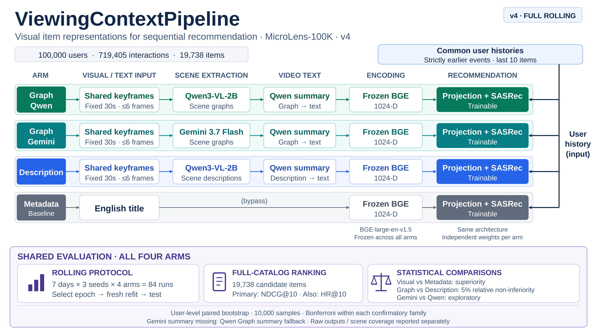

# ViewingContextPipeline

영상에서 추출한 정보를 **item representation으로 사용했을 때의 순차 추천 성능**을 비교하는 연구용 PoC입니다. MicroLens-100K에서 영문 title, Graph 기반 요약, Description 기반 요약을 BGE로 임베딩하고 동일한 SASRec 구조로 평가합니다.

이 실험은 title 표현을 시각 기반 표현으로 교체했을 때의 효과를 측정합니다. Title과 시각 정보의 결합 효과, 온라인 추천 효과, 모델의 일반적인 우열은 검증 범위에 포함하지 않습니다.

## 연구 질문과 파이프라인

| 연구 질문 | 비교 | 판정 |
| --- | --- | --- |
| 시각 기반 표현이 title 표현보다 추천에 유용한가? | 각 시각 표현 Arm vs Metadata | NDCG@10 우월성 |
| Graph 기반 표현이 Description의 추천 성능을 유지하는가? | 각 Graph Arm vs Description | 상대 비열등성 허용폭 5% |
| Graph 추출 모델을 바꾸면 결과가 달라지는가? | Graph Gemini vs Graph Qwen | 탐색적 비교 |



[편집용 PPTX](docs/design/Diagram.pptx)

| Arm | 추천·진단의 `--target` 이름 | BGE 입력 | 장면 추출 → 영상 요약 |
| --- | --- | --- | --- |
| Metadata · Baseline | `METADATA` | 영문 title | 없음 |
| Graph Qwen | `GRAPH_QWEN` | Graph 기반 요약 텍스트 | Qwen3-VL-2B → Qwen3-VL-2B |
| Graph Gemini | `GRAPH_GEMINI` | Graph 기반 요약 텍스트 | Gemini 3.7 Flash → Qwen3-VL-2B |
| Description | `DESC_QWEN` | Description 기반 요약 텍스트 | Qwen3-VL-2B → Qwen3-VL-2B |

Graph는 영상의 개체·행동·상황 등을 구조화한 중간 표현이며, 이를 요약한 **텍스트를 BGE-large-en-v1.5로 인코딩**합니다. 모든 Arm은 같은 사용자·item ID 이력·분할·catalog를 사용하고 각각 독립적으로 학습합니다. BGE 특징은 고정하지만 이후 projection과 SASRec은 학습하며, 별도 학습 가능한 item ID embedding을 더하지 않습니다.

Scene은 기본 **30초의 고정 구간**입니다. 각 구간을 나누어 중앙 시각에서 최대 6장의 keyframe을 추출하고, 세 시각 경로에 동일한 이미지를 제공합니다. Graph와 Description은 프롬프트·출력 형식·토큰 예산도 다르므로 결과는 현재 구성한 표현 생성 방식의 비교로 해석합니다.

## 실험 조건

기본 v4 실험은 **100,000명·719,405개 사건·19,738개 아이템**을 보존합니다. 여기서 사건은 timestamp가 있는 사용자–아이템 interaction입니다.

| 항목 | 기본 조건 |
| --- | --- |
| 평가 기간 | 마지막 UTC 관측일을 제외한 직전 7일. 공식 데이터는 2022-09-05~11 |
| 학습·평가 대상 | 이전 이력이 있는 사건. 무이력 사건도 원본과 이후 이력에는 보존 |
| 입력 이력 | 정답보다 엄격히 앞선 시각의 최근 10개 아이템 |
| epoch 선택 | 평가 전날 이전 사건으로 학습하고, 전날 validation으로 epoch 선택 |
| refit·test | 같은 seed의 새 모델을 평가일 이전 사건으로 refit한 뒤 당일 test |
| 평가 중 이력 | 모델 파라미터는 고정하며, 당일 정답보다 앞선 사건도 이력에 반영 |
| 후보군 | 전체 19,738개를 점수화. 이전 관측 아이템은 정답을 제외하고 마스킹 |
| 반복 | 7일 × 4 Arm × seed 42·43·44 = **84개 독립 조합** |
| 집계 | 날짜·seed별 적격 사건 평균을 구한 뒤 seed·날짜에 동일 가중치 적용 |
| 통계 | 주 지표 NDCG@10, 사용자 단위 paired bootstrap 10,000회 |

각 조합은 selection → refit → test를 수행합니다. 날짜 간 checkpoint를 이어서 학습하지 않습니다. Metadata 대비 우월성 3개와 Graph–Description 비열등성 2개는 **각 비교군에 α=0.05와 Bonferroni 보정**을 적용합니다. Gemini–Qwen 비교는 보정 없는 탐색적 비교입니다. 시간 경계·학습 설정·통계의 세부 규칙은 [전체 실험 가이드](docs/full_rolling.md)에 있습니다.

## 실행 준비

명령은 **Ubuntu/Bash와 저장소 루트** 기준입니다. Python 3.11+를 사용하며, GPU 장비와 Gemini API VM을 나누거나 한 장비에서 실행할 수 있습니다.

| 실행 환경 | 담당 단계 | 필요한 자원 |
| --- | --- | --- |
| GPU 실행 환경 | 데이터 준비, Qwen 추출·모든 요약, BGE 임베딩, SASRec | CUDA GPU, 로컬 Qwen/BGE checkpoint. 원본 영상 준비에는 ffmpeg·ffprobe |
| Gemini API 실행 환경 | 준비된 keyframe의 Gemini Graph 추출 | Gemini SDK, Vertex ADC와 프로젝트 호출 권한, cohort·timestamp·keyframe |

환경이 이미 있으면 재사용합니다. GPU 환경을 새로 만드는 예입니다.

```bash
conda create -n vc_gpu python=3.11 -y
conda activate vc_gpu
python -m pip install -e ".[qwen,train,dev]"
python -m pip check
```

Qwen은 `vllm==0.28.0`을 사용합니다. GPU당 메모리·동시 요청 설정은 [Qwen 실행 가이드](docs/qwen_vllm.md)를 참고하세요.

Gemini 전용 VM은 다음처럼 준비합니다. 준비된 이미지를 사용할 때 GPU·Qwen/BGE checkpoint·원본 영상·ffmpeg는 필요하지 않습니다.

```bash
conda create -n vc_cloud python=3.11 -y
conda activate vc_cloud
python -m pip install -e ".[gemini,dev]"
python -m pip check
```

Vertex 인증은 VM 서비스 계정 또는 사용자 ADC를 사용합니다. 선택한 프로젝트·모델을 호출할 권한이 필요합니다. 같은 환경에서 GPU 단계와 Gemini를 모두 실행하려면 설치 extras에 `gemini`도 포함합니다.

데이터는 [공식 MicroLens portal](https://recsys.westlake.edu.cn/)에서 준비합니다. 데이터와 모델은 자동 다운로드되지 않습니다.

| 입력·설정 | 준비할 내용 |
| --- | --- |
| `data.pairs_csv` | `MicroLens-100k_pairs.csv`: `user,item,timestamp`, 정수 밀리초 |
| `data.pairs_tsv` | 사용자별 interaction 정합성 확인용 TSV. 파일이 있으면 검사 |
| `data.videos_dir` | item ID를 파일명으로 사용하는 `{item_id}.mp4` 디렉터리 |
| `data.titles_csv` | 아래에서 생성할 `MicroLens-100k_title_en_completed.csv` |
| `models.qwen`, `models.bge` | Qwen3-VL-2B-Instruct, BGE-large-en-v1.5의 로컬 checkpoint |
| `models.gemini` | Vertex project ID, location, model ID |
| `artifacts_root` | 산출물 상위 디렉터리. 기본값 `artifacts` |

[pipeline.yaml](config/pipeline.yaml)을 실제 경로에 맞춥니다. 아래 예시는 `artifacts_root: artifacts` 기준이며, 변경했다면 명령의 산출물 경로도 맞춰야 합니다.

두 장비를 사용하는 경우 **같은 run ID·코드·생성 조건**을 사용합니다. GPU 장비에서 준비한 `experiment.json`, `data/cohort/`, `data/resized_keyframes/`를 Gemini VM의 같은 run 아래에 전달합니다. Gemini 결과는 GPU 장비로 돌려보냅니다. `artifacts/`는 Git에 포함되지 않습니다. [환경 간 전달 규칙](docs/full_rolling.md#환경-간-전달)을 참고하세요.

## 실행 순서

### 1. 입력 검사와 데이터 준비

GPU 실행 환경에서 새 실험의 고유 run ID를 지정하고 전체 입력 목록·rolling 분할을 검사합니다. `--plan-only`는 영상 처리와 모델 추론을 실행하지 않습니다.

```bash
export RUN_ID=microlens100k_rolling7_YYYYMMDD
python -m validation prepare-cohort --run-id "$RUN_ID" --plan-only
```

`artifacts/$RUN_ID/data/cohort/cohort_plan.json`을 확인한 뒤, 영문 title의 결측을 공식 보완 파일로 채웁니다. `--output`은 설정의 `data.titles_csv`와 같아야 합니다.

```bash
ANNOTATIONS=/path/to/Annotations
python -m validation.complete_titles \
  --primary "$ANNOTATIONS/MicroLens-100k_title_en.csv" \
  --supplement "$ANNOTATIONS/MicroLens-50k_titles.csv" \
  --required-items "artifacts/$RUN_ID/data/cohort/required_items.jsonl" \
  --output "$ANNOTATIONS/MicroLens-100k_title_en_completed.csv" \
  --unresolved-policy zero-vector

python -m validation prepare-cohort --run-id "$RUN_ID"
python -m extraction prepare-input-data --run-id "$RUN_ID"
```

보완 후에도 빈 title은 **해당 Metadata 입력만 1024차원 영벡터**로 처리합니다. 아이템·사건은 보존하며 Graph/Description에는 이 정책을 적용하지 않습니다. CSV 자체나 필수 아이템 행이 없는 경우는 오류입니다.

`prepare-cohort`는 영상 존재·크기·중복과 title을 검사하고, `prepare-input-data`가 영상 길이 조회·timestamp 계산·keyframe 추출을 수행합니다. 완료 후 `data/cohort/media_preflight.json`에서 장면·이미지 수와 저장공간 추정치를 확인합니다.

### 2. 장면 추출과 영상 요약

GPU 환경에서 Qwen 경로를 실행합니다. `--gpus`는 사용할 visible GPU 개수이며 기본값은 1입니다. 각 GPU에 독립 vLLM 엔진을 올리므로 선택한 GPU를 해당 명령에 할당합니다.

```bash
python -m extraction extract-graph-scenes --model qwen --run-id "$RUN_ID" --gpus 1
python -m extraction summarize-graph --source qwen --run-id "$RUN_ID" --gpus 1
python -m extraction extract-description-scenes --run-id "$RUN_ID" --gpus 1
python -m extraction summarize-description --run-id "$RUN_ID" --gpus 1
```

Gemini VM에서 동일 run의 준비된 입력에 접근한 뒤 실행합니다.

```bash
conda activate vc_cloud
export RUN_ID=microlens100k_rolling7_YYYYMMDD  # GPU 환경과 같은 값
python -m extraction extract-graph-scenes --model gemini --run-id "$RUN_ID"
```

현재 추출 CLI는 **cohort 전체의 keyframe을 요구**하며 일부 영상만 고르는 옵션은 없습니다. 샘플 이미지만 옮긴 상태에서는 전체 실행이 중단됩니다.

`extraction/graph/gemini/` 결과를 GPU 환경의 같은 run으로 전달한 뒤 **Qwen으로 Gemini Graph를 요약**합니다.

```bash
conda activate llmjg
python -m extraction summarize-graph --source gemini --run-id "$RUN_ID" --gpus 1
```

### 3. 임베딩·추천·진단

GPU 환경에서 각 영상의 표현을 생성하고 추천 실험을 실행합니다. Gemini summary가 없는 아이템은 아래의 Qwen 대체 정책을 적용합니다.

```bash
python -m validation embed-representations --run-id "$RUN_ID"
python -m validation run-recommendation --run-id "$RUN_ID"
python -m validation run-diagnosis --run-id "$RUN_ID"
```

기본 추천은 단일 GPU에서 실행합니다. GPU 4장에 조합을 병렬 배분하려면 위 추천 명령 대신 다음을 사용합니다. GPU당 worker 2개는 시작 예시이며 실제 처리량은 측정해야 합니다.

```bash
CUDA_VISIBLE_DEVICES=0,1,2,3 python -m validation run-recommendation \
  --run-id "$RUN_ID" --gpus 4 --workers-per-gpu 2
```

일부 Arm만 학습하려면 **추천과 진단 양쪽에** `--target GRAPH_QWEN DESC_QWEN METADATA`처럼 지정합니다. 이 예는 63개 조합이며, 생략하면 전체 84개입니다. `--target`은 추출·요약·임베딩 범위를 바꾸지 않습니다. [모드 선택과 재개](docs/full_rolling.md#모드-선택)에 자세한 예시가 있습니다.

## 결과 해석

결과는 `artifacts/{run_id}/` 아래에 저장됩니다.

| 확인할 파일·필드 | 의미 |
| --- | --- |
| `validation/diagnosis/diagnosis.json` | 선택한 Arm의 실행 유효성·추천 지표·통계 비교 |
| `recommendations.daily`, `recommendations.means` | 날짜·seed별 사건 평균과 seed·날짜 균등 평균. HR/NDCG@4·8·10·20·30 |
| `statistics.comparisons` | 효과 크기·신뢰구간·우월성 또는 비열등성 판정 |
| `scene_coverage`, `generation_recovery`, `gemini_summary_fallbacks` | 장면 coverage, Raw 사용·복구 정보, Gemini의 Qwen 대체 목록 |
| `validation/recommendations/{date}/seed_{seed}/{arm}/` | 조합별 `training.json`, `per_event_metrics.jsonl`, `sasrec.pt`, `complete.json` |

`runtime_decision.status=pass`와 `statistics.status=computed`는 **선택 범위의 실행·통계 계산이 유효함**을 뜻합니다. 연구 가설 성립은 각 비교의 판정을 따로 확인합니다. 비열등성은 평균 점수만 비교하지 않고, 상대 차이의 보정 신뢰구간 하한이 −5%보다 큰지 판단합니다.

결과를 해석할 때 다음 처리 비율도 함께 봅니다.

- **Gemini 대체:** Gemini summary 파일이 없을 때만 같은 영상의 Qwen Graph summary를 사용합니다. 따라서 Graph Gemini Arm에는 Qwen 표현이 섞일 수 있습니다. 정상·Raw Gemini summary가 있으면 이를 우선하고, 잘못된 파일은 오류로 처리합니다.
- **Raw 사용:** 구조 검증·Repair 후에도 실패한 비어 있지 않은 생성 원문을 명시적인 Raw 산출물로 보존할 수 있습니다. Raw Graph도 요약 입력에 들어가므로 모든 입력이 정상 구조화 Graph인 것은 아닙니다. Qwen Graph·Description summary 누락을 영벡터로 대체하지 않습니다.
- **Coverage:** 정상 장면 coverage 최소 0.95와 Arm 간 gap 최대 0.05를 검사하며, Raw Graph는 정상 coverage에 포함하지 않습니다. 이 기준은 산출물의 완전성을 보는 것으로 영상 이해 정확도와 같지 않습니다.

빈 날짜·잘못된 분모·불완전한 결과·coverage 미달은 통계 판정을 중단시킵니다. 단위 테스트 통과, 실제 API·GPU 단계 성공, 전체 실험 완료는 구분합니다.

## 재개와 상세 문서

같은 입력·설정에서 중단됐다면 **같은 run ID와 명령으로 재실행**합니다. 추출·요약은 정상·Raw 결과를 재사용하고 실패·미완료 작업을 처리합니다. 추천은 유효한 완료 조합을 재사용하며, 미완료 조합은 selection부터 다시 학습합니다. epoch 중간 재개는 지원하지 않습니다.

`--force`는 지정한 추출·요약 Step의 기존 완료 결과도 재생성하며 다른 Step을 자동 실행하지 않습니다. 추천에서는 선택한 Arm의 모든 날짜·seed 조합을 재학습합니다. 장면을 갱신했다면 요약 → 임베딩 → 추천 → 진단을 차례로 실행해 변경을 반영합니다. 같은 run의 추천 명령을 동시에 실행하지 마세요.

실험 조건을 비교할 때는 새 run ID를 사용합니다. `experiment.json`은 최초 설정 snapshot이며 모든 후속 변경을 기록하지 않습니다. 서로 다른 sampling 조건의 산출물을 한 run에 섞지 않습니다.

- [전체 실험·입력 준비·환경 간 전달·복구 규칙](docs/full_rolling.md)
- [Qwen vLLM 설정·진행률·GPU 성능 측정](docs/qwen_vllm.md)
- [파이프라인 설정](config/pipeline.yaml) · [추출·요약 프롬프트](config/prompts/)
