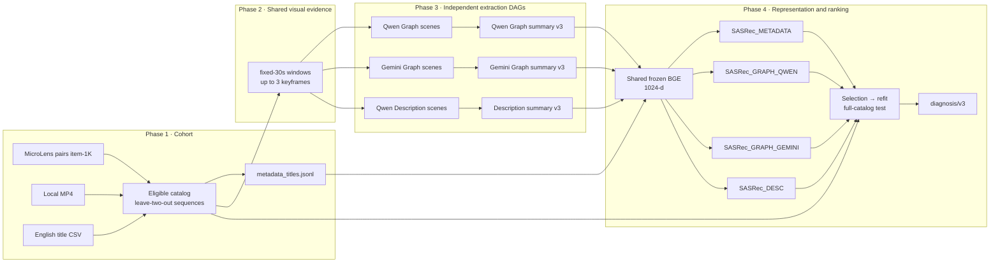

# ViewingContextPipeline

MicroLens-100K item-1K에서 **동일한 행동 sequence의 item representation만 바꾸었을 때** next-item ranking이 어떻게 달라지는지 확인하는 visual Viewing Context PoC입니다.

현재 저장소에서 검증된 범위는 코드, CLI, schema, artifact lifecycle입니다. 실제 MicroLens 입력으로 Linux GPU/Qwen, Vertex/Gemini, BGE, SASRec의 11단계를 완주한 새 pilot은 이 구현에 포함되지 않습니다. 따라서 현재 상태만으로 추천 품질, CTR, watch time, 만족도, 제품 효과, 인과효과 또는 VLM의 일반적 우열을 주장하지 않습니다.

## 이 PoC가 답하려는 질문

- Creator-written English title을 사용한 `SASRec_METADATA`보다 visual Graph/Description representation이 이 protocol에서 유용한가?
- 제약된 `minimal-semantic-v2` Graph가 자연어 Description에 비해 선언된 ranking utility를 보존하는가?
- 동일 Graph prompt를 사용해도 Qwen과 Gemini extractor source에 따라 downstream 결과가 달라지는가?

이 연구는 [Describe What You See](<docs/Describe What You See Paper.pdf>)의 정확 재현이 아닙니다. 논문의 전체 데이터, global rolling split, 전체 영상을 1 FPS로 입력한 multimodal caption 조건 대신 item-1K, leave-two-out, visual-only fixed-30s 조건을 사용합니다.

## 현재 파이프라인



Qwen Graph, Gemini Graph, Description은 서로 독립적인 extraction DAG입니다. 저장소에는 이들을 자동으로 묶어 실행하거나 downstream을 자동 무효화하는 tracked full-run runner가 없습니다.

| Arm | BGE 입력 | Scene extractor | 역할 |
| --- | --- | --- | --- |
| `SASRec_METADATA` | Creator-written English title | 없음 | Primary conventional baseline |
| `SASRec_GRAPH_QWEN` | Qwen Graph의 7-field summary | Qwen 2B | TV on-device VLM 제약을 근사한 Graph arm |
| `SASRec_GRAPH_GEMINI` | Gemini Graph의 7-field summary | Gemini | Extractor-source 민감도를 보는 exploratory Graph arm |
| `SASRec_DESC` | Qwen Description의 7-field summary | Qwen 2B | Graph와 자연어 정보 표현을 비교하는 arm |

모든 arm의 행동 sequence와 join key는 item ID입니다. Metadata/Graph/Description은 sequence를 video scene으로 바꾸는 것이 아니라, sequence 각 위치에 연결되는 item vector를 바꿉니다.

## 왜 이렇게 설계했는가

아래의 “통제 의도”는 실험 설계 이유이지, 현재 코드 검증만으로 입증된 결과가 아닙니다.

| 설계 선택 | 현재 구현과 통제 의도 | 남는 한계 |
| --- | --- | --- |
| `visual_only` | VC extraction에서 시각 신호를 격리합니다. | Multimodal 성능 주장이 아니며 Metadata title baseline은 이 modality의 예외입니다. |
| 동일 `fixed_30s` evidence | Branch 간 입력 keyframe을 통제합니다. 완전한 30초 window는 10초 구간 midpoint인 `+5/+15/+25`를 사용하고 partial window는 최대 3장을 사용합니다. | 영상 전체 사건을 완전히 관찰한다는 뜻이 아닙니다. |
| Source-neutral Graph v2 prompt | Qwen/Gemini가 같은 [Graph prompt](config/prompts/graph_scene_v2.md)를 받아 extractor source 차이를 봅니다. | Qwen–Gemini 비교는 exploratory이며 일반 모델 우열 benchmark가 아닙니다. |
| Raw Graph + warning | JSON object는 변형·deduplication하지 않고 ontology 위반을 `semantic_warnings`에 남깁니다. | Warning이 많은 scene도 downstream에 포함되므로 warning rate를 함께 봐야 합니다. |
| 공통 summary budget | 세 VC branch가 동일한 7-field v3, field당 20 words, comma 최대 2개, 512-token 상한을 사용합니다. | Ontology와 upstream extraction 차이는 남고 공통 Qwen summarizer 편향도 가능해집니다. |
| 공통 frozen BGE | Metadata title과 세 VC summary를 같은 `bge-large-en-v1.5` 1024-d 공간으로 인코딩합니다. | 같은 encoder가 representation의 모든 의미 차이를 공정하게 보존한다고 보장하지 않습니다. |
| 독립 content arms | 네 arm 모두 frozen feature를 512-d로 projection하며 ID embedding을 추가하지 않습니다. | VC의 incremental uplift가 아니라 standalone replacement 비교입니다. |
| Full eligible catalog | Pairs에서 참조되고 local MP4 검증을 통과하며 title이 완전한 catalog 전체를 scoring합니다. | “Full”은 MicroLens 전체가 아니며 제외 규모의 외적 영향은 별도 판단 대상입니다. |
| Selection 후 refit | Train에서 학습하고 validation NDCG@10으로 epoch를 정한 뒤, 같은 seed의 새 모델을 train+valid target으로 정확히 그 epoch만큼 refit합니다. | Item-1K와 적은 user 수에서 선택 분산이 클 수 있습니다. |
| Actual-artifact diagnosis | Marker가 아니라 title, NPZ, scene outcome, metric grid, training history, checkpoint를 다시 읽습니다. | Provenance fingerprint를 대체하지 않으므로 의미 있는 입력 변경에는 새 `run_id`가 필요합니다. |

`SASRec`은 1024→512 trainable projection, item ReLU residual MLP, 2-block/2-head causal PreNorm Transformer, 2048 FFN, dropout 0.1, 마지막 유효 위치의 user GELU residual MLP를 사용합니다. Sequence는 right-padding하며 dot product로 full catalog를 scoring합니다. Train interaction frequency의 power 1.0으로 `logQ` correction을 적용하고, 같은 target의 다른 in-batch occurrence는 false negative가 되지 않도록 mask합니다. 이는 [MicroLens text SASRec 설정](https://raw.githubusercontent.com/westlake-repl/MicroLens/0fc876066987fb3b920df2765cfbac2763c515eb/Code/VideoRec/SASRec/run_text.py), [MicroLens loss 구현](https://raw.githubusercontent.com/westlake-repl/MicroLens/0fc876066987fb3b920df2765cfbac2763c515eb/Code/VideoRec/SASRec/model/model.py), [PinnerFormer](https://cs.stanford.edu/~jure/pubs/pinnerformer-kdd22.pdf)을 참고한 근사 구현이며 정확 재현으로 주장하지 않습니다.

> [직접 결정 필요] 실제 pilot 해석 전 `min_scene_coverage=0.95`, arm coverage gap `0.05`, partial summary 허용 여부, primary NDCG@10, non-inferiority margin `0.05`, comparison family와 multiplicity 정책을 승인해야 합니다. 현재 값은 provisional PoC 계약입니다.

## 실행 전 조건과 빠른 시작

- Python 3.11+와 conda 환경 `llmjg`
- `ffmpeg`, `ffprobe`가 `PATH`에 존재
- Linux/CUDA, Qwen checkpoint, 충분한 GPU memory (`Qwen` scene/summary pilot)
- Vertex ADC, project 권한, location, quota, 비용 승인 (`Gemini` branch)
- `MicroLens-100k_pairs_1k.tsv`: `user_id<TAB>space-separated item ids`
- `MicroLens-100k_title_en.csv`: 각 줄을 첫 comma에서만 나눈 `positive item_id,title`; UTF-8 BOM 허용
- 양의 정수를 stem으로 갖는 local `{item_id}.mp4`
- `config/pipeline.yaml`의 data/model 경로가 실행 host에서 유효

```powershell
conda activate llmjg

# 코드·계약 검증
python -m pip install -e ".[dev]"

# 실제 extraction/recommendation profile
python -m pip install -e ".[qwen,gemini,train,dev]"
```

`prepare-cohort`는 MP4 기준 eligible catalog를 먼저 정한 뒤 title coverage를 검사합니다. 전체 CSV의 잘못된 item ID와 duplicate는 오류입니다. Blank/missing title은 eligible catalog 안의 item에 대해서만 `data/cohort/failures.jsonl`에 `missing_metadata_title`로 기록하고 실행을 중단합니다. Catalog 밖의 blank title은 실행을 막지 않으며, fallback title이나 조용한 catalog 축소는 없습니다.

## 11단계 실행

아래 예시는 Bash입니다. PowerShell에서는 `export` 대신 `$env:RUN_ID = "..."`를 사용합니다. v1 config, ID-arm checkpoint, `diagnosis/v2`, prompt/schema 변경 전 artifact를 재사용하지 말고 새 `run_id`를 사용하십시오.

```bash
export RUN_ID=pilot_item1k_v2_YYYYMMDD

# Phase 1 · cohort (1)
python -m validation prepare-cohort --run-id "$RUN_ID"

# Phase 2 · shared visual evidence (2)
python -m extraction prepare-input-data --run-id "$RUN_ID"

# Phase 3 · three independent extraction DAGs (3–8)
python -m extraction extract-graph-scenes --model qwen --run-id "$RUN_ID" --gpus 1
python -m extraction summarize-graph --source qwen --run-id "$RUN_ID" --gpus 1
python -m extraction extract-graph-scenes --model gemini --run-id "$RUN_ID"
python -m extraction summarize-graph --source gemini --run-id "$RUN_ID" --gpus 1
python -m extraction extract-description-scenes --run-id "$RUN_ID" --gpus 1
python -m extraction summarize-description --run-id "$RUN_ID" --gpus 1

# Phase 4 · representation, recommendation, diagnosis (9–11)
python -m validation embed-representations --run-id "$RUN_ID"
python -m validation run-recommendation --run-id "$RUN_ID"
python -m validation run-diagnosis --run-id "$RUN_ID"
```

Qwen은 `device_map=cuda`와 `bfloat16`을 사용하므로 `--gpus` 생략이 CPU 실행을 뜻하지 않습니다. 설정된 `batch_size=256`은 user sequence를 복제하는 값이 아닙니다. 현재 item-1K cohort의 `user_count=59`에서는 실제 sequence batch가 최대 59입니다.

## 결과를 읽는 순서

`artifacts/{run_id}/validation/diagnosis/diagnosis.json`을 다음 순서로 해석합니다.

1. **Test pass**: Ruff/core/Torch profile이 구현 계약을 통과했는가?
2. **Runtime and coverage**: `runtime_decision.status`, `checks`, `errors`, `scene_coverage`가 실제 artifact의 완전성을 통과했는가?
3. **Statistical status and comparisons**: `statistical_analysis.status`, warnings, 선언된 여섯 비교를 해석할 수 있는가?
4. **External and product validity**: 이 protocol 밖의 사용자 경험이나 제품 지표로 일반화할 근거가 있는가?

Runtime이 실패하면 통계 결과를 해석하지 않습니다. `computed_with_warnings`는 계산 성공과 결론 가능성을 동일시하지 않습니다. Sparse Description control 때문에 conditional bootstrap만 가능하면 non-inferiority는 `not_evaluable_sparse_control`로 남습니다. `bootstrap resample has zero control mean` 오류도 숨기지 않습니다.

Diagnosis의 비교 family는 다음과 같습니다.

| Family | 비교 | 역할 |
| --- | --- | --- |
| `metadata_baseline_superiority` | Graph Qwen, Graph Gemini, Description − Metadata | Confirmatory, Bonferroni 3개 |
| `graph_vs_description_non_inferiority` | Graph Qwen/Graph Gemini − Description | Confirmatory, Bonferroni 2개 |
| `qwen_vs_gemini` | Graph Gemini − Graph Qwen | Exploratory 1개 |

## Artifact, cache, 실패, 재실행

```text
artifacts/{run_id}/
├─ data/
│  ├─ cohort/
│  │  ├─ item_inventory.jsonl
│  │  ├─ catalog.jsonl
│  │  ├─ sequences.jsonl
│  │  ├─ metadata_titles.jsonl
│  │  ├─ eligibility_summary.json
│  │  └─ source_assets/{content_id}/assets/timestamp_fixed_30s.json
│  └─ fixed_30s/resized_keyframes/{content_id}/*.png
├─ extraction/
│  ├─ graph/{qwen,gemini}/
│  │  ├─ scenes/{content_id}.jsonl
│  │  ├─ scenes/failures/{content_id}.jsonl
│  │  ├─ summaries/{content_id}.json
│  │  └─ summaries/failures/{content_id}.jsonl
│  └─ description/
│     ├─ scenes/{content_id}.jsonl
│     ├─ scenes/failures/{content_id}.jsonl
│     ├─ summaries/{content_id}.json
│     └─ summaries/failures/{content_id}.jsonl
└─ validation/
   ├─ representations/
   │  ├─ item_index.json
   │  ├─ metadata_embeddings.npz
   │  ├─ graph_qwen_embeddings.npz
   │  ├─ graph_gemini_embeddings.npz
   │  └─ desc_embeddings.npz
   ├─ recommendations/
   │  ├─ per_user_metrics.jsonl
   │  ├─ training_runs.jsonl
   │  └─ checkpoints/seed_{seed}/{arm}/sasrec.pt
   └─ diagnosis/diagnosis.json
```

| 상황 | 조치 |
| --- | --- |
| 동일 계약의 중단·누락 | 같은 명령을 재실행합니다. 완료 content는 cache에서 재사용합니다. |
| Failure scene 재생성 | 해당 extraction에 `--force` 후 summary → embedding → recommendation → diagnosis 순서로 재실행합니다. |
| Data/config/model/prompt/schema/protocol 변경 또는 legacy artifact | 새 `run_id`로 1단계부터 실행합니다. Migration/compatibility alias는 없습니다. |
| Diagnosis 재검사 | `run-diagnosis`를 그대로 재실행합니다. 실제 파일을 다시 읽고 기존 문서를 덮어씁니다. |

`--force`는 해당 단계만 재생성하며 downstream을 자동 무효화하지 않습니다. Manifest/fingerprint도 없으므로 “파일이 존재한다”는 사실이 provenance 일치를 뜻하지 않습니다.

Scene/summary failure JSONL은 append-only history가 아니라 현재 unresolved failure state입니다. 성공 retry 또는 완전한 cache reuse 뒤 stale·empty failure 파일은 제거됩니다. Scene 명령의 exit code 0은 stage가 계속 실행되었다는 뜻이며 모든 scene의 성공을 보장하지 않습니다. 성공 artifact와 failure artifact가 동시에 남을 수 있으므로 coverage는 diagnosis에서 확인합니다.

## Scene, summary, diagnosis 계약

<details>
<summary>Graph scene · outer 5 fields, inner minimal-semantic-v2</summary>

Outer row는 정확히 다음 다섯 필드입니다.

```text
scene_idx, keyframes, graph, parse_mode, semantic_warnings
```

Inner Graph는 `setting_context`, `entities`, `events`, `semantic_topics`, `affect`를 사용합니다. Entity에는 `local_id`, `name`, `salience`, `function`, `count`가 있고, event는 최대 4개, topic은 최대 3개입니다. `role`, `static_relations`, `affect.subject_ids`는 제거되었습니다.

Native JSON object를 우선 읽고 실패 시 deterministic syntax-only repair를 적용합니다. JSON object이면 entity 수가 많더라도 원문을 변형·축약·semantic deduplication하지 않습니다. Exact keys, enum, ID/reference, caps, count, function 제약 위반은 deterministic `semantic_warnings`에 기록하며 syntax parse/repair 실패만 scene failure입니다.

</details>

<details>
<summary>Description scene · exact 5 fields</summary>

```text
schema_version, content_id, scene_idx, keyframes, description
```

Description은 visible fact만 사용하고 story, intent, identity, demographics, purpose, audience, cultural context, OCR transcription을 금지합니다. Graph와 Description은 grounding 원칙은 공유하지만 prompt와 ontology는 동일하지 않습니다.

</details>

<details>
<summary>Video summary v3 · exact 7 labeled lines</summary>

```text
setting_and_environments: ...
main_characters_and_objects: ...
chronological_events: ...
relations: ...
visual_atmosphere: ...
visible_affect: ...
semantic_topics: ...
```

Prompt는 각 값을 한 줄의 자연스러운 문장, field당 최대 20 words, comma 최대 2개로 요구합니다. Parser는 첫 `:`에서만 나누고 label의 추가·누락·중복·순서 변경과 별도 prose를 거부합니다. 개별 값은 비어도 되지만 일곱 값 전체가 비면 실패합니다. 검증 뒤 `sections` dictionary와 canonical `text`로 저장되므로 BGE 입력 순서는 고정됩니다. v2, missing/extra field는 migration하지 않습니다.

</details>

주요 schema는 다음과 같습니다.

```text
viewing-context-config/v2
validation-config/v2
microlens-cohort-eligibility/v2
metadata-title/v1
scene-description/v1
graph-video-summary/v3
description-video-summary/v3
sasrec-training-run/v2
diagnosis/v3
```

`diagnosis/v3`는 Metadata title/embedding coverage, 네 NPZ의 catalog order·shape·finiteness, 4 arm × 3 seed의 selection/refit record와 checkpoint, full-catalog metric grid, scene coverage를 실제 파일에서 재검사합니다.

## 운영과 문제 해결

### Qwen summary failure

Summary는 누락 content를 batch 처리하고 content마다 한 번만 생성합니다. 자동 retry와 retry 전용 prompt는 없습니다. Validation failure 때만 `[Qwen_summary_*_fail]` 로그와 raw output을 콘솔에 표시하고 `summaries/failures/`에 기록합니다. 다음 실행은 완료 artifact를 재사용하고 실패·누락 content만 다시 처리합니다.

- `extraction.greedy_decoding: true`: `do_sample=false`
- `extraction.greedy_decoding: false`: 별도 fixed seed 없이 `temperature=0.2`, `top_p=0.8`, `top_k=20`
- `summary_repetition_penalty=1.05`: generated token에 적용
- Graph/Description summary output 상한: 512 tokens

Prompt, decoding, model을 바꾼 실험은 새 `run_id`가 필요합니다.

### Qwen GPU는 동작하지만 로그·파일이 늦는 경우

Scene 결과는 callback이 돌아온 시점에 content-local artifact로 checkpoint됩니다. GPU generation이 아직 반환되지 않았다면 GPU utilization이 있어도 새 scene 로그와 파일 mtime이 멈춰 있을 수 있습니다. 완료 content만 cache reuse 대상이며 partial content는 다음 실행에서 content 단위로 다시 처리합니다. Qwen interrupt는 exit code 130을 사용하고 이미 저장된 artifact를 유지합니다.

### Gemini interrupt

Ctrl+C는 local wait와 pending task를 정리하지만 이미 Vertex에 전송된 요청의 원격 취소를 보장하지 않습니다. 비용·quota를 고려해 별도로 확인하십시오.

### Cache가 의심스러운 경우

Metadata title, summary, embedding, training record가 현재 config와 의미적으로 같은지 자동 판별하는 fingerprint는 없습니다. 의미 있는 입력 변경이면 cache를 고치려 하지 말고 새 `run_id`를 사용합니다.

## 검증 수준

Core profile은 Torch 학습을 제외한 계약을 검사합니다.

```powershell
conda activate llmjg
ruff check .
pytest -q --ignore=tests/validation/test_model.py
python -m compileall -q src tests
```

Torch profile은 skip 없이 별도로 통과해야 합니다. Projection/residual/initialization/causal padding, NumPy 기준 `logQ` loss, duplicate target mask, finite guard, 4 arm × 3 seed × 1 epoch selection/refit smoke와 12 checkpoint를 검사합니다.

```powershell
conda activate llmjg
python -c "import torch; print(torch.__version__)"
pytest -q -m torch tests/validation/test_model.py
```

실제 pilot 완료에는 새 `run_id`의 11단계, Linux GPU Qwen/BGE/SASRec, Vertex Gemini, runtime/coverage pass, statistical status와 warning 해석이 모두 필요합니다.

> [직접 결정 필요] 비용이 발생하는 GPU/Vertex pilot 실행 범위와 provisional 통계·coverage 정책 승인 전에는 품질 결론을 내리지 않습니다.

## 설계 자료

- [2026-08-27 pipeline PNG snapshot](docs/design/ViewingContextPipeline_260827.png) — ID baseline을 포함한 과거 dated snapshot
- [Pipeline overview PPTX snapshot](docs/design/ViewingContextPipeline_Overview.pptx) — 과거 설계 자료
- [Describe What You See paper](<docs/Describe What You See Paper.pdf>)
- [Video-only prompt note](docs/DescribeWhatYouSee_prompt_video_only.md)
- [ItemRAG paper](<docs/ItemRAG Paper.pdf>)

현재 구현 구조의 source of truth는 위 Mermaid, `config/pipeline.yaml`, CLI help, artifact/schema 검사 코드입니다. Dated PNG/PPTX는 현재 DAG 계약으로 해석하지 않습니다.
