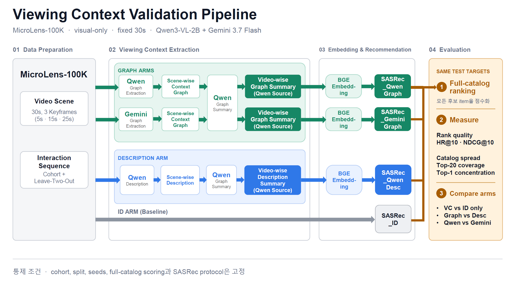

# ViewingContextPipeline

MicroLens-100K의 동일한 시각 evidence를 Graph와 Description으로 표현했을 때,
고정된 next-item ranking protocol에서 어떤 차이가 생기는지 측정하는 PoC 파이프라인입니다.

> 현재 저장소가 검증하는 것은 **코드와 artifact 계약**입니다. 실제 MicroLens 데이터, Linux GPU, Qwen checkpoint, Vertex Gemini를 사용한 전체 pilot을 실행하기 전에는 추천 품질 결과가 검증된 것이 아닙니다.

## 이 PoC의 의도

| 비교                        | 역할                         | 해석                                                                                                |
| --------------------------- | ---------------------------- | --------------------------------------------------------------------------------------------------- |
| 각 VC arm vs SASRec_ID      | confirmatory superiority     | ID embedding을 대체한 visual representation이 이 protocol에서 standalone ranking utility를 보이는가 |
| 두 Graph arm vs SASRec_DESC | confirmatory non-inferiority | 선언된 margin 안에서 Description 대비 ranking utility를 보존하는가                                  |
| GRAPH_GEMINI vs GRAPH_QWEN  | exploratory                  | downstream 결과가 Graph extractor source에 얼마나 민감한가                                          |

VC feature는 ID embedding에 더해지는 것이 아니라 이를 **대체**합니다. 따라서 VC-vs-ID 결과는 ID에 visual context를 추가했을 때의 incremental uplift가 아닙니다.
Gemini Graph-vs-Description 비교에는 extractor와 representation 차이가 함께 포함됩니다.
이 PoC는 CTR, watch time, 만족도, 온라인 효과, 인과효과, VLM 자체의 보편적 우열을 주장하지 않습니다.

## Pipeline Overview



| Arm                 | item representation                       | scene extractor          | summarizer |
| ------------------- | ----------------------------------------- | ------------------------ | ---------- |
| SASRec_ID           | trainable ID embedding                    | 없음                     | 없음       |
| SASRec_GRAPH_QWEN   | frozen BGE feature + trainable projection | Qwen Graph               | Qwen       |
| SASRec_GRAPH_GEMINI | frozen BGE feature + trainable projection | Gemini Graph             | Qwen       |
| SASRec_DESC         | frozen BGE feature + trainable projection | Qwen visible description | Qwen       |

## 설계 근거

아래 표의 “통제 의도”는 설계 가설이며 repo 자체가 그 타당성을 증명하지는 않습니다.

| 설계 선택                          | 현재 구현                                                                        | 통제 의도                                           | 남는 한계                                                                     |
| ---------------------------------- | -------------------------------------------------------------------------------- | --------------------------------------------------- | ----------------------------------------------------------------------------- |
| visual_only                        | audio, OCR, metadata를 VLM evidence로 사용하지 않음                              | 시각 representation 차이를 격리                     | multimodal 성능을 말할 수 없음                                                |
| 동일 fixed_30s evidence            | 30초 window마다 최대 3개의 10초 구간 midpoint 사용. 완전한 window는 +5/+15/+25초 | branch별 입력 차이 제거                             | 마지막 partial window의 midpoint는 달라지며 keyframe 사이 사건을 놓칠 수 있음 |
| source-qualified Graph             | Qwen/Gemini scene·failure·summary 경로 분리                                    | artifact 혼합 방지와 extractor 민감도 측정          | API 설정, generation, repair율 영향도 함께 포함                               |
| scene 후 video summary             | scene artifact와 failure를 먼저 저장한 뒤 video 단위 summary 생성                | scene 근거를 감사하면서 BGE 입력 단위를 통일        | partial failure가 체계적이면 branch별 evidence subset이 달라질 수 있음        |
| 공통 Qwen summary·7-field v3·BGE | 세 VC branch의 output shape와 encoder 고정                                       | 형식·요약기 차이의 교란을 줄임                     | 공통 Qwen summarizer가 중립적이지 않을 수 있음                                |
| 독립 4-arm SASRec                  | 같은 cohort, split, seeds, backbone, hyperparameters                             | representation 외 학습 조건 고정                    | ID+VC 결합 효과가 아닌 replacement 비교                                       |
| full eligible catalog              | pairs에서 참조되고 local MP4 validation을 통과한 전체 item                       | selected-user union으로 후보군이 축소되는 오류 방지 | 제외 video가 estimand에 미치는 영향은 별도 판단 필요                          |
| actual-artifact diagnosis          | completion marker 대신 실제 artifact 재검사                                      | 누락·손상·stale artifact 발견                     | config/prompt/model provenance와 downstream invalidation은 자동화하지 않음    |

> **[직접 결정 필요]** 실제 pilot 해석 전 min_scene_coverage=0.95, max_arm_coverage_gap=0.05, partial summary 허용 여부, primary NDCG@10, non-inferiority margin 0.05, comparison family와 multiplicity 정책을 확정해야 합니다. 
> 현재 값은 provisional PoC 계약입니다.

## 실행 전 준비

### 공통 조건

- Python 3.11 이상과 conda 환경 llmjg
- ffmpeg와 ffprobe가 PATH에 존재
- config/pipeline.yaml의 data/model 경로가 실행 host에서 유효
- MP4 filename stem은 양의 정수
- pairs TSV는 user_id, TAB, space-separated item ids 형식

```powershell
conda activate llmjg

# 코드·계약 검증용
python -m pip install -e ".[dev]"

# 실제 Qwen/Gemini/BGE/SASRec pilot용
python -m pip install -e ".[qwen,gemini,train,dev]"
```

Qwen extraction은 device_map=cuda와 bfloat16을 사용하므로 --gpus 생략이 CPU  실행을 의미하지 않습니다. 실제 pilot은 Linux/CUDA 환경에서 checkpoint 경로와 GPU memory를 확인해야 합니다.

## E2E 실행 방법

아래 예시는 Bash입니다. PowerShell에서는 RUN_ID 대신 $env:RUN_ID 변수를 사용합니다. 모든 단계는 같은 run_id를 사용합니다.

```bash
export RUN_ID=pilot_1k_v3_YYYYMMDD

# Phase 1: cohort
python -m validation prepare-cohort --run-id "$RUN_ID"

# Phase 2: shared visual evidence
python -m extraction prepare-input-data --run-id "$RUN_ID"

# Phase 3: three independent extraction branches
python -m extraction extract-graph-scenes --model qwen --run-id "$RUN_ID" --gpus 1
python -m extraction summarize-graph --source qwen --run-id "$RUN_ID" --gpus 1
python -m extraction extract-graph-scenes --model gemini --run-id "$RUN_ID"
python -m extraction summarize-graph --source gemini --run-id "$RUN_ID" --gpus 1
python -m extraction extract-description-scenes --run-id "$RUN_ID" --gpus 1
python -m extraction summarize-description --run-id "$RUN_ID" --gpus 1

# Phase 4: representation, recommendation, diagnosis
python -m validation embed-representations --run-id "$RUN_ID"
python -m validation run-recommendation --run-id "$RUN_ID"
python -m validation run-diagnosis --run-id "$RUN_ID"
```

## 결과를 읽는 순서

artifacts/{run_id}/validation/diagnosis/diagnosis.json을 다음 순서로 봅니다.

1. runtime_decision.status, checks, errors
   - catalog, sequence, scene, embedding, metric, training run, checkpoint의 현재 artifact 완전성을 뜻합니다. 실패하면 통계 결과를 해석하지 않습니다.
2. statistical_analysis.status, errors, warnings
   - computed_with_warnings는 계산은 완료됐지만 조건부 해석이 필요하다는 뜻입니다.
   - sparse Description control에서는 non-inferiority가 not_evaluable_sparse_control로 남으며 결론을 내리지 않습니다.
3. comparisons
   - superiority, non-inferiority, exploratory family의 선언된 decision을 봅니다.
   - 단순 평균은 metrics, coverage·concentration·frequency bucket은 diagnostics에서 확인합니다.
4. 외적·제품 타당성
   - 이 고정 protocol의 결과를 CTR, 인과효과 또는 일반 영상 이해 성능으로 확대하지 않습니다.

test pass는 구현 계약, runtime pass는 artifact 완전성, comparison decision은 이 protocol 안의 통계 결과입니다. 세 단계는 서로 대체되지 않습니다.

## 재사용·실패·재실행

이 저장소는 manifest/fingerprint로 config, prompt, model 변경을 자동 감지하지 않습니다. --force도 downstream artifact를 자동 무효화하지 않습니다.

| 상황                                                       | 조치                                                                                         |
| ---------------------------------------------------------- | -------------------------------------------------------------------------------------------- |
| 동일한 현재 v3 계약에서 중단 또는 누락                     | 같은 명령 재실행. 완료 content는 재사용                                                      |
| failure scene을 다시 생성                                  | 해당 extraction에 --force, 이어서 summary → embedding → recommendation → diagnosis 재실행 |
| data, cohort, config, model, prompt, schema, protocol 변경 | 새 run_id로 처음부터 실행                                                                    |
| v2, 추가 필드, 비정규 text 등 legacy artifact              | migration하지 않음. 새 run_id가 기본이며 같은 실험의 단순 재생성만 --force 사용              |
| diagnosis만 현재 파일 기준으로 재검사                      | run-diagnosis 재실행. 기존 diagnosis를 신뢰하지 않고 덮어씀                                  |

scene failure JSONL은 `scenes/failures/`, summary failure JSONL은 `summaries/failures/`에 둡니다. failure artifact는 append-only history가 아니라 **현재 unresolved failure state**입니다. 성공한 재실행 또는 완전한 cache reuse 뒤에는 stale·empty failure 파일을 삭제합니다. failure 파일 부재만으로 완전성을 판단하지 말고 diagnosis를 확인해야 합니다. summary failure row는 `summary-generation-failure/v1`이며 content, attempt, seed, failure kind, error, raw response를 기록합니다.

Qwen scene 단계는 GPU worker 시작을 알린 뒤 scene이 하나 끝날 때마다 결과를 출력하고, 해당 content에서 지금까지 완료된 scene subset을 원자적으로 JSONL에 checkpoint합니다. content progress bar는 그 content의 모든 scene이 끝나야 1 증가합니다. GPU가 사용 중이어도 새 scene 로그와 파일 수정 시각이 모두 멈춰 있다면 현재 generation이 아직 반환되지 않은 상태이며, worker가 살아 있는 동안 별도의 generation timeout은 적용하지 않습니다. Ctrl+C 전까지 저장된 partial checkpoint는 남지만 같은 명령을 재실행하면 incomplete content 전체를 다시 생성하고, 완료 content만 cache에서 재사용합니다.

summary 단계는 실행 시점에 누락된 content를 한 batch로 한 번씩 생성합니다. 성공한 content는 7-line 응답 검증 직후 v3 JSON artifact로 저장하고, 실패한 content만 `summaries/failures/`에 남깁니다. worker 준비·generation 시작·대기 상태는 콘솔에 출력하지 않으며, 최종 validation failure만 `[Qwen_summary_*_fail]` 로그로 오류와 raw output을 함께 출력합니다. 자동 retry는 없습니다. 같은 명령을 다시 실행하면 완료 artifact는 재사용하고 실패·누락 content만 다시 생성합니다.

Qwen summary decoding은 `config/pipeline.yaml`의 `extraction.greedy_decoding`으로 선택합니다. `true`는 `do_sample=false`, `false`는 seed를 별도로 고정하지 않은 sampling이며 `extraction.summary_sampling`의 `temperature`, `top_p`, `top_k`를 사용합니다. 현재 sampling 설정은 `0.2`, `0.8`, `20`입니다. 동일 실행의 단순 중단·실패 resume에는 같은 `run_id`를 쓸 수 있지만, prompt·decoding 설정·model 등 실험 조건을 바꾸는 경우에는 새 `run_id`가 필요합니다.

## Artifact map

```text
artifacts/{run_id}/
├─ data/cohort/
│  ├─ item_inventory.jsonl
│  ├─ catalog.jsonl
│  ├─ sequences.jsonl
│  ├─ eligibility_summary.json
│  └─ source_assets/{content_id}/assets/timestamp_fixed_30s.json
├─ data/fixed_30s/resized_keyframes/{content_id}/*.png
├─ extraction/
│  ├─ graph/{qwen,gemini}/
│  │  ├─ scenes/{content_id}.jsonl
│  │  ├─ scenes/failures/{content_id}.jsonl
│  │  ├─ summaries/{content_id}.json
│  │  └─ summaries/failures/{content_id}.jsonl
│  └─ description/
│     ├─ scenes/{content_id}.jsonl
│     ├─ scenes/failures/{content_id}.jsonl
│     ├─ summaries/{content_id}.json
│     └─ summaries/failures/{content_id}.jsonl
└─ validation/
   ├─ representations/
   ├─ recommendations/
   └─ diagnosis/diagnosis.json
```

<details>
<summary>단계별 대표 출력</summary>

| Phase          | Step                  | 대표 출력                                     |
| -------------- | --------------------- | --------------------------------------------- |
| Cohort         | prepare-cohort        | catalog, sequences, eligibility summary       |
| Evidence       | prepare-input-data    | timestamp JSON, resized keyframes             |
| Extraction     | scene 단계            | source-qualified scene과 선택적 failure JSONL |
| Summary        | summary 단계          | content별 v3 summary JSON                     |
| Representation | embed-representations | 세 branch NPZ와 item index                    |
| Recommendation | run-recommendation    | per-user metrics, training runs, checkpoints  |
| Diagnosis      | run-diagnosis         | diagnosis/v2 document                         |

</details>

## 핵심 데이터 계약

### Graph scene

각 row는 정확히 다음 5개 필드만 가집니다.

```text
scene_idx, keyframes, graph, parse_mode, semantic_warnings
```

Graph output은 native JSON object를 먼저 읽고 실패 시 deterministic syntax-only repair를 한 번 적용합니다.
유효하지만 entity가 많은 JSON을 semantic deduplication하거나 임의로 축약하지 않습니다.
structural/reference 문제는 semantic_warnings에 기록하고 scene 실패와 분리합니다.

### Description scene

각 row는 정확히 다음 5개 필드만 가집니다.

```text
schema_version, content_id, scene_idx, keyframes, description
```

Description prompt는 직접 보이는 사실만 허용하며 story, intent, identity, demographics, purpose, audience, cultural context, OCR transcription을 금지합니다.
Graph prompt와 공통 원칙은 visible-only grounding이지만 세부 규칙은 branch별 prompt가 source of truth입니다.

### Video summary v3

Graph와 Description summary 모델은 JSON 대신 다음 7개 labeled text line을 정확한 순서로 출력합니다. 각 줄은 첫 번째 `:`에서만 label과 값으로 나누므로 값 안의 추가 `:`는 허용됩니다.

```text
setting_and_environments: ...
main_characters_and_objects: ...
chronological_events: ...
relations: ...
visual_atmosphere: ...
visible_affect: ...
semantic_topics: ...
```

파서는 label의 추가·누락·중복·순서 변경과 별도 prose를 거부합니다. 개별 값은 빈 문자열일 수 있지만 7개 전체가 비어 있으면 실패합니다. 검증된 응답은 기존 v3 artifact의 `sections` dictionary로 변환되므로 저장 schema와 BGE 입력의 canonical section text는 바뀌지 않습니다.

한 명령 실행에서는 content마다 한 번만 생성하며 자동 retry나 retry 전용 prompt는 없습니다. 실패 응답은 정상 summary로 저장하지 않습니다. 다음 실행에서 decoding mode를 조정해 실패 content를 수동 resume할 수 있으며, 기존에 완료된 content는 `--force`를 쓰지 않는 한 재사용됩니다. sampled mode에서 pipeline 자체는 seed를 고정하지 않습니다.

주요 schema version은 viewing-context-config/v1, scene-description/v1, graph-video-summary/v3, description-video-summary/v3, sasrec-training-run/v1, diagnosis/v2입니다.

## 검증 수준

### 코드·계약 검증

```powershell
conda activate llmjg
ruff check .
pytest -q
python -m compileall -q src tests
```

core suite에서 Torch test가 skip되면 전체 검증 성공으로 간주하지 않습니다. Torch가 설치된 train profile에서는 4개 arm, 3개 seed의 학습 smoke와 right-padding·finite score를 별도로 통과해야 합니다.

```powershell
python -c "import torch"
pytest -q tests/validation/test_model.py
```

### 실제 pilot 검증

다음은 synthetic/unit test로 대체할 수 없습니다.

- 새 run_id의 실제 11단계 실행
- Linux GPU에서 Qwen scene·summary와 BGE/SASRec 실행
- Vertex ADC·quota·비용 조건에서 Gemini branch 실행
- 실제 MicroLens cohort의 runtime/coverage pass
- statistical status, warning, comparison decision의 명시적 해석

## 설계 자료

- [Pipeline overview PPTX](docs/design/ViewingContextPipeline_Overview.pptx)
- [2026-08-27 design snapshot](docs/design/ViewingContextPipeline_260827.png)
