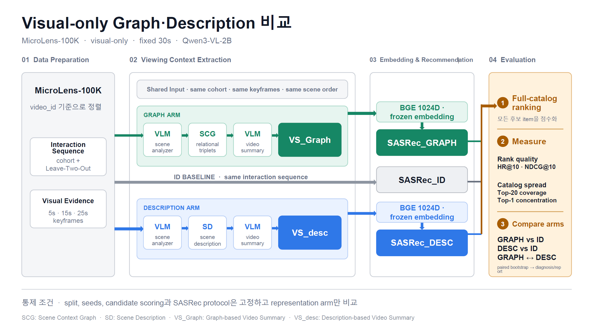

# ViewingContextPipeline

## Pipeline Overview



MicroLens-100K local MP4에서 visual-only Viewing Context를 추출하고, 같은 cohort·split·seed의 독립 SASRec arm으로 비교하는 파이프라인입니다.

고정 pilot protocol은 다음과 같습니다.

```text
MicroLens-100K
  + visual_only
  + fixed_30s (5s, 15s, 25s keyframes)
  + Qwen3-VL-2B
  + SASRec_ID vs SASRec_GRAPH vs SASRec_DESC
```

이 코드는 지정된 next-item ranking protocol의 차이를 측정합니다. 결과를 CTR, 시청시간, 만족도 또는 인과효과로 해석하지 않습니다.

## Package 구조

```text
src/
├─ extraction/               # visual evidence, scene Graph/Description, video summaries
├─ validation/               # cohort, BGE, SASRec, diagnosis
└─ viewing_context_pipeline/ # fixed config context와 전체 DAG runner
```

`extraction`과 `validation`은 독립 CLI를 제공합니다. 전체 runner도 같은 step handler를 호출하므로 별도 구현 경로가 없습니다.

## Step DAG

```text
prepare-cohort
  → prepare-input-data
    ├→ extract-graph-scenes → summarize-graph
    └→ extract-description-scenes → summarize-description
      → embed-representations → run-recommendation → run-diagnosis
```

Graph arm은 fixed-30s 장면의 시간순 keyframe 1–3장을 한 번에 보고 `minimal-semantic-scene/v1` graph를 만든 뒤 Qwen으로 영상 단위 요약을 생성합니다. Graph에는 coarse setting, visible entities/events, optional `WEARING`, grounded semantic topics, visible affect만 포함됩니다.

Description arm은 같은 keyframe에서 장면별 factual description을 생성한 뒤 별도 Qwen 호출로 영상 단위 요약을 생성합니다. 두 arm은 같은 visual evidence fingerprint와 deterministic generation 설정을 사용합니다.

## 설정

실행 시 `config/pipeline.yaml` 하나를 고정으로 읽습니다. 이 파일에는 protocol, 로컬 data/model 경로, generation, cohort, BGE, SASRec, evaluation 설정이 모두 포함됩니다.

```powershell
conda activate llmjg
Copy-Item config/pipeline.example.yaml config/pipeline.yaml
python -m pip install -e ".[qwen,train]"
```

```bash
conda activate llmjg
cp config/pipeline.example.yaml config/pipeline.yaml
python -m pip install -e ".[qwen,train]"
```

`config/pipeline.yaml`은 machine-local 경로를 포함하므로 Git에서 제외됩니다. 각 run에 사용된 전체 설정은 runtime snapshot에 저장됩니다.

Graph scene prompt와 minimal taxonomy는 `extraction.semantic_graph`가 코드로 소유합니다. enum과 제한에서 동적으로 렌더링된 prompt 및 taxonomy mapping의 fingerprint를 기록하므로 둘 중 하나가 바뀌면 Graph scene과 실제 downstream만 다시 실행됩니다. 별도의 ontology JSON은 사용하지 않습니다.

Qwen scene analyzer는 category/type, `IS_A`, `INTERACTS_WITH`, relation family, scene function, media/style, confidence/score를 출력하지 않습니다. Facet Projector, PPR, TVTI 축·점수·UI는 이 pilot DAG 범위 밖입니다.

현재 Graph scene 출력은 JSON object 여부만 확인하며 semantic field, enum, ID reference는 검증하지 않습니다. Prompt로 출력 구조를 유도하지만 dangling reference를 포함한 응답도 원문 그대로 artifact에 저장합니다.

## 독립 step 실행

모든 명령은 명시적인 `--run-id`를 요구합니다. 선행 단계를 자동 실행하지 않으며, matching manifest와 output이 있으면 기본적으로 resume합니다.
`prepare-input-data`는 cohort item을 4개 worker thread로 병렬 처리하고 content 단위 progress bar를 표시하며, 최종 manifest는 원래 catalog 순서를 유지합니다.

editable install을 하지 않은 Linux checkout에서는 저장소 루트에서 먼저 source root를 등록합니다. `src`는 module 이름이 아니므로 `python -m src.validation`은 사용하지 않습니다.

```bash
export PYTHONPATH="$PWD/src${PYTHONPATH:+:$PYTHONPATH}"
python -m validation prepare-cohort --run-id 1k_pilot_260825
```

```powershell
python -m validation prepare-cohort --run-id 1k_pilot_260825
python -m extraction prepare-input-data --run-id 1k_pilot_260825
python -m extraction extract-graph-scenes --run-id 1k_pilot_260825
python -m extraction summarize-graph --run-id 1k_pilot_260825
python -m extraction extract-description-scenes --run-id 1k_pilot_260825
python -m extraction summarize-description --run-id 1k_pilot_260825
python -m validation embed-representations --run-id 1k_pilot_260825
python -m validation run-recommendation --run-id 1k_pilot_260825
python -m validation run-diagnosis --run-id 1k_pilot_260825
```

각 CLI의 `--force`는 요청한 step만 다시 수행하고 실제 downstream manifest만 stale 처리합니다. 반대쪽 Extraction arm의 산출물은 보존합니다.

CUDA를 사용하는 네 Extraction step은 `--gpus N`으로 GPU 개수를 지정할 수 있습니다. 예를 들어 `--gpus 2`는 기본적으로 CUDA 장치 `0`, `1`에 worker process를 하나씩 만들고 각 process에서 Qwen을 한 번 로드합니다. `CUDA_VISIBLE_DEVICES`가 설정되어 있으면 그 목록의 앞에서부터 N개를 사용합니다. Scene 추출은 한 콘텐츠 안의 scene을, summary 생성은 콘텐츠를 worker에 round-robin으로 분배합니다. 옵션을 생략하면 기존 단일 GPU 직렬 실행을 사용합니다.

```powershell
python -m extraction extract-graph-scenes --run-id 1k_pilot_260825 --gpus 2
python -m extraction summarize-graph --run-id 1k_pilot_260825 --gpus 2
python -m extraction extract-description-scenes --run-id 1k_pilot_260825 --gpus 2
python -m extraction summarize-description --run-id 1k_pilot_260825 --gpus 2
```

네 Extraction step은 content 단위 progress bar를 표시합니다. Scene 결과는 content 내부에서 `scene_idx` 순으로 `[Graph]` 또는 `[Desc]` 블록을 출력하고, summary는 병렬 생성이 완료되는 즉시 `[Summary_graph]` 또는 `[Summary_desc]` 블록으로 출력합니다. Resume된 content는 별도 로그 없이 progress bar의 초기 완료 수에 포함됩니다.

## 전체 실행

```powershell
python -m viewing_context_pipeline run --run-id 1k_pilot_260824 --gpus 2
```

```bash
bash run.sh 1k_pilot_260824 --gpus 2
```

지원 옵션:

- `--force-stage <step>`: 해당 step과 실제 downstream만 재실행
- `--dry-run`: preflight와 stage 순서만 표시하고 artifact를 쓰지 않음
- `--gpus N`: 네 Qwen Extraction step에서 사용할 CUDA 장치 개수

완전히 새 실행은 새 `run-id`를 사용합니다. 동일한 `run-id`의 config fingerprint가 runtime snapshot과 다르면 실행을 거부합니다. `--resume`, `--config`, `--local-config` 및 이전 underscore stage 이름은 지원하지 않습니다.

## Artifact 구조

```text
artifacts/{run_id}/
├─ runtime/config_snapshot.json
├─ pipeline_manifest.json
├─ manifests/{step}.json
├─ data/
│  ├─ cohort/
│  └─ fixed_30s/visual_manifest.jsonl
├─ extraction/
│  ├─ graph/scenes/{content_id}.jsonl
│  ├─ graph/summaries/{content_id}.json
│  ├─ description/scenes/{content_id}.jsonl
│  └─ description/summaries/{content_id}.json
└─ validation/
   ├─ representations/
   ├─ recommendations/
   └─ diagnosis/
```

두 파일 기반 runtime snapshot이나 legacy flat-triple output은 읽지 않습니다. 각 step manifest는 upstream, taxonomy, rendered prompt, model 및 output fingerprint를 기록합니다.

주요 계약:

- `viewing-context-config/v1`
- `minimal-semantic-scene/v1`
- `graph-video-summary/v1`
- `scene-description/v1`
- `description-video-summary/v1`
- `visual-manifest/v1`
- `step-manifest/v1`
- `representations/v1`
- `recommendations/v1`
- `diagnosis/v1`
- `pipeline-run/v1`

## Optional Extraction API

Gemini와 ASR/OCR multimodal 전처리는 canonical DAG에 포함되지 않는 Python API입니다. 필요한 extra만 별도로 설치합니다.

```powershell
python -m pip install -e ".[gemini]"
python -m pip install -e ".[multimodal]"
```

Graph와 Description 코어는 `VLMBackend.generate(images, prompt, max_new_tokens, references=())` 계약을 사용합니다. `QwenBackend`와 `GeminiBackend`가 이 계약을 구현합니다.

```python
from extraction import GeminiBackend, prepare_multimodal_evidence

backend = GeminiBackend.vertex(
    project_id="my-project",
    model_id="gemini-model-id",
)

manifest = prepare_multimodal_evidence(
    "video.mp4",
    "timestamp_fixed_30s.json",
    "optional_multimodal_output",
    asr_model="small",
    ocr_model_root="/models/PaddleOCR",
)
```

Optional API의 결과는 고정 pilot 결과나 canonical stage manifest로 해석하지 않습니다.

## 검증

```powershell
conda activate llmjg
ruff check src tests
python -m pytest -q tests
python -m compileall -q src tests
git diff --check
```

synthetic test와 contract test 통과는 구현 검증입니다. 실제 MicroLens·GPU pilot이 실행되기 전에는 실제 추천 품질 결과로 보고하지 않습니다.
