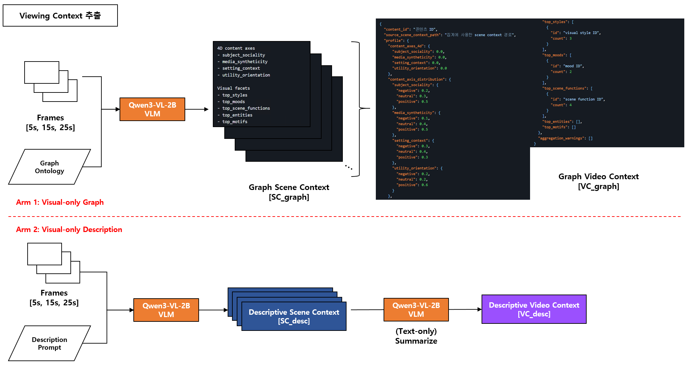
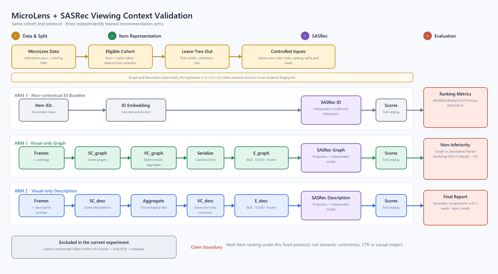

# ViewingContextPipeline

MicroLens interaction으로 실험 cohort를 고정하고, 같은 `fixed_30s` keyframe에서 `VP_graph`와 `VP_desc`를 처음부터 생성한 뒤 독립 SASRec arm으로 비교하는 monorepo입니다.

현재 canonical protocol은 다음으로 고정합니다.

- 입력: MicroLens MP4와 interaction pairs
- 시각 입력: `img_only`, 30초 Scene의 실제 midpoint keyframe `5/15/25초`
- Graph arm: `SC_graph → VC_graph → VP_graph`
- Description arm: `Scene Description → VP_desc`
- 평가: 같은 cohort·split·seed를 사용한 ID, Graph, Description SASRec

이 평가는 고정된 protocol에서의 next-item ranking 차이를 측정합니다. CTR, 시청시간, 만족도 또는 인과효과를 주장하지 않습니다.

## 전체 흐름





그림의 `VC_desc`는 영상 단위 description 표현을 뜻하는 개념명입니다. 실제 저장·handoff 계약의 이름은 `VP_desc`이며 코드와 파일 경로에서는 `VP_desc`만 사용합니다.

```text
preflight
→ prepare-cohort
→ import-microlens
→ extract-graph
→ build-graph-profiles
→ build-description-profiles
→ materialize-representations
→ run-experiment
```

`validation/`이 먼저 cohort와 `vce_selection.jsonl`을 만들고, `extraction/`이 그 selection 전체의 새 visual artifact를 생성합니다. 마지막으로 `validation/`이 paired profile completeness와 공통 evidence fingerprint를 확인한 뒤 BGE와 SASRec을 실행합니다.

## 설정

```powershell
conda activate llmjg
Copy-Item config/local.example.yaml config/local.yaml
```

`config/local.yaml`에는 데이터와 모델의 머신별 경로만 기록합니다. 이 파일과 모든 실행 산출물은 Git에서 제외됩니다.

- `config/pipelines/microlens_graph_vs_desc_pilot.yaml`: 1K user pilot
- `config/pipelines/microlens_graph_vs_desc_canonical.yaml`: 100K user canonical
- `config/local.yaml`: MP4, pairs/title/tag, Qwen, BGE 경로

실행 전에 `extraction/requirements-*.txt`, `validation[train]`, `requirements-orchestration.txt`의 현재 환경용 dependency를 준비해야 합니다.

## 통합 실행

```powershell
conda activate llmjg
python -m scripts.run_pipeline `
  --config config/pipelines/microlens_graph_vs_desc_pilot.yaml `
  --local-config config/local.yaml `
  --stage all
```

새 실행은 비어 있는 `artifacts/{run_id}`만 허용합니다. 기존 run을 자동 삭제하거나 덮어쓰지 않습니다. 중단된 실행은 `--resume`, 특정 단계부터 다시 실행할 때는 `--force-stage STAGE`를 사용합니다.

실행 없이 경로와 component 명령을 확인하려면 `--dry-run`을 사용합니다.

## 단계별 독립 실행

각 단계는 선행 단계를 자동 호출하지 않습니다. 필요한 입력이 없으면 예상 경로와 함께 실패합니다.

```powershell
python -m scripts.preflight --config $PIPELINE --local-config config/local.yaml
python -m scripts.prepare_cohort --config $PIPELINE --local-config config/local.yaml
python -m scripts.import_microlens --config $PIPELINE --local-config config/local.yaml
python -m scripts.extract_graph --config $PIPELINE --local-config config/local.yaml
python -m scripts.build_graph_profiles --config $PIPELINE --local-config config/local.yaml
python -m scripts.build_description_profiles --config $PIPELINE --local-config config/local.yaml
python -m scripts.materialize_representations --config $PIPELINE --local-config config/local.yaml
python -m scripts.run_experiment --config $PIPELINE --local-config config/local.yaml
```

기존 component CLI도 각각 `extraction/`, `validation/`에서 독립 실행할 수 있습니다. 세부 설정과 출력은 [Extraction](extraction/README.md), [Validation](validation/README.md)을 참고합니다.

## 산출물과 계약

```text
artifacts/{run_id}/
├─ runtime/                 # 실행 시 해석된 component config
├─ validation/cohort/      # cohort, catalog, vce_selection
├─ extraction/microlens/   # keyframe, SC/VC Graph, VP_graph, VP_desc
├─ validation/representations/
├─ validation/experiment/  # checkpoints, metrics, report, readiness
└─ pipeline_manifest.json
```

루트 `contracts/`는 component 간 handoff인 `vce_selection`과 `visual_profile`만 소유합니다. Extraction ontology와 Validation report schema는 각 component가 소유합니다.

기존 `ViewingContextExtraction/output/`은 이 pipeline에서 읽거나 수정하지 않습니다.

## 검증

```powershell
conda activate llmjg
python -m pytest -q tests/integration
Push-Location extraction; python -m pytest -q; Pop-Location
Push-Location validation; python -m pytest -q; Pop-Location
```
