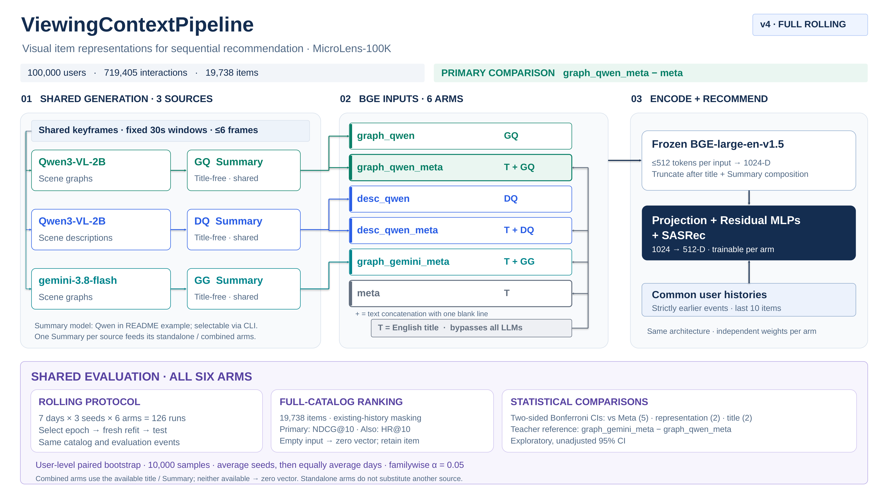

# ViewingContextPipeline v5



MicroLens-100K 영상의 Description, Scene Graph, 영문 title 표현을 BGE로 임베딩하고 동일한 SASRec 구조로 추천 성능을 비교하는 PoC입니다. 영문 title에 Description 또는 Scene Graph 정보를 추가했을 때의 효과를 title 단독 기준선과 비교합니다.

요약 입력은 `English Title → Scene observations` 순서로 구성하며, 준비된 cohort의 `metadata_titles.jsonl`에서 콘텐츠별 제목을 가져옵니다. 제목이 비어 있으면 `(unavailable)`로 표시하고 장면만 요약합니다. 두 v4 요약 프롬프트는 제목과 장면을 함께 요약하되 충돌 시 장면을 우선합니다. 제목은 요약 provenance와 입력 해시에 포함됩니다. 기존 요약의 자동 무효화는 수행하지 않으므로 변경을 적용하려면 새 Run을 사용하거나 요약 명령에 `--force`를 지정하세요.

## 비교 Arm

각 Run은 선택한 프롬프트로 하나의 Graph 표현을 평가합니다. ASIS·TOBE 전용 설정이나 버전별 Arm은 없으며, 프롬프트 경로·내용 해시와 생성 provenance로 실험을 구분합니다.

| 입력 표현 | Arm / CLI target |
| --- | --- |
| English Title + Gemini Description → Qwen/Gemini Summary | `desc_gemini` |
| English Title + Qwen Description → Qwen/Gemini Summary | `desc_qwen` |
| English Title + Gemini Graph → Qwen/Gemini Summary | `graph_gemini` |
| English Title + Qwen Graph → Qwen/Gemini Summary | `graph_qwen` |
| 영문 title | `metadata` |

```yaml
protocol:
  arms: [desc_gemini, desc_qwen, graph_gemini, graph_qwen, metadata]
```

`protocol.arms`는 실행할 Arm 목록이자 Validation 교집합의 기준입니다. Validation의 `--target`은 이 목록의 부분집합이어야 합니다. embedding·추천·진단에서 `--target`을 생략하면 이 목록을 사용합니다. CLI, 저장 문서의 `arm`, embedding 파일명, 추천 디렉터리와 진단은 위의 고정 이름을 사용합니다. 프롬프트 파일명의 버전을 바꿔도 Arm 이름은 바뀌지 않습니다.

Run 내부에서는 표현 방식(Description–Graph), 추출 모델(Gemini–Qwen), 컨텍스트 제공(시각 표현–Metadata)을 비교합니다. Graph 프롬프트 간 비교는 Run을 나누어 수행합니다. 모델 비교는 현재 프롬프트·fallback을 포함한 파이프라인 비교로 해석합니다.

## 실행 준비

Ubuntu/Bash, Python 3.11+와 저장소 루트를 기준으로 합니다. 입력 준비에는 ffmpeg·ffprobe가 필요합니다. 모델과 데이터는 자동 다운로드하지 않습니다.

```bash
python -m pip install -e ".[qwen,train,gemini,dev]"
python -m pip check
```

Gemini 전용 환경은 `.[gemini,dev]`로 설치할 수 있습니다. Vertex ADC와 설정한 프로젝트·모델 호출 권한, 준비된 cohort·timestamp·공유 keyframe이 필요합니다. Qwen은 로컬 checkpoint와 vLLM 0.28.0을 사용합니다. [Qwen 실행 가이드](docs/qwen_vllm.md)를 참고하세요.

[config.yaml](config.yaml)에서 다음 경로와 모델 설정을 맞춥니다.

| 설정 | 입력 |
| --- | --- |
| `data.pairs_csv` | `user,item,timestamp` CSV, 정수 밀리초 |
| `data.pairs_tsv` | 존재하면 CSV와 사용자별 interaction multiset을 검증 |
| `data.videos_dir` | `{item_id}.mp4` 파일들 |
| `data.titles_csv` | 원본 `MicroLens-100k_title_en.csv` (영문 title) |
| `data.titles_supplement_csv` | 보완용 `MicroLens-50k_titles.csv`. 지정하면 빈 제목·누락 행을 자동 보완 |
| `models.qwen`, `models.bge` | 로컬 모델 디렉터리 |
| `models.gemini` | Vertex 프로젝트·위치·모델·생성 설정 |
| `artifacts_root` | 산출물 상위 경로. 기본 `artifacts` |

## 전체 실행

```bash
RUN_ID=experiment_v5

python -m preparation prepare-cohort --run-id "$RUN_ID"
python -m preparation prepare-input-data --run-id "$RUN_ID"

python -m extraction extract-description-scenes --run-id "$RUN_ID" --schema prompts/description_scene_v2.md --model qwen
python -m extraction extract-description-scenes --run-id "$RUN_ID" --schema prompts/description_scene_v2.md --model gemini
python -m extraction extract-graph-scenes --run-id "$RUN_ID" --schema prompts/graph_scene_v3.md --model qwen
python -m extraction extract-graph-scenes --run-id "$RUN_ID" --schema prompts/graph_scene_v3.md --model gemini

python -m extraction summarize-description --run-id "$RUN_ID" --schema prompts/description_summary_v4.md --source qwen --model qwen
python -m extraction summarize-description --run-id "$RUN_ID" --schema prompts/description_summary_v4.md --source gemini --model qwen
python -m extraction summarize-graph --run-id "$RUN_ID" --schema prompts/graph_summary_v4.md --source qwen --model qwen
python -m extraction summarize-graph --run-id "$RUN_ID" --schema prompts/graph_summary_v4.md --source gemini --model qwen

python -m validation embed-representations --run-id "$RUN_ID" --summary-source qwen
python -m validation run-recommendation --run-id "$RUN_ID"
python -m validation run-diagnosis --run-id "$RUN_ID"
```

`prepare-cohort` 한 번으로 required items 생성 → 원본·보완 CSV의 제목 병합 → 영상·제목 검증을 완료합니다. 원본의 비어 있지 않은 제목을 우선하고, 필요한 아이템의 빈 제목·누락 행만 보완합니다. 끝내 찾지 못한 제목은 빈 값으로 저장해 Metadata embedding에서 영벡터로 처리합니다. 보완 CSV 자체가 없거나 손상된 경우에는 실패합니다.

병합 결과는 `artifacts/preparation/cohort/metadata_titles.jsonl`, 출처·보완 통계는 같은 폴더의 `cohort_plan.json`에 저장합니다. 원본 CSV를 변경하거나 별도 completed CSV·report 파일을 만들지 않습니다. `--plan-only`나 별도 `validation.complete_titles` 실행은 필요하지 않습니다. 재실행하면 최신 CSV를 다시 읽습니다. 이미 완성된 제목 CSV를 사용할 때는 `data.titles_csv`에 지정하고 `data.titles_supplement_csv`를 생략하면 됩니다(이 경우 누락 행은 오류).

기존 `validation.complete_titles` 독립 명령도 유지합니다. 수동 실행 시 `--required-items`의 현재 경로는 `artifacts/preparation/cohort/required_items.jsonl`이며 이전 `data/cohort/` 경로를 사용하지 않습니다. `--plan-only`는 목록만 미리 확인할 때 선택적으로 사용할 수 있습니다.

`--schema`는 **실제 존재하는 Markdown 프롬프트 파일 하나**입니다. 저장소 루트 기준 상대 경로와 절대 경로를 허용합니다. 와일드카드 문자열은 허용하지 않습니다. 네 생성 명령에서 필수이며, 추출은 `--model`, 요약은 `--source`도 필수입니다. 요약 모델은 항상 Qwen이고 `--source`는 입력 장면을 만든 모델입니다. Graph 명령은 항상 `graph`에 쓰며 선택 프롬프트와 관계없이 `entities / relations / context` 출력 계약으로 검증합니다.

요약 명령에는 `--source qwen|gemini`(장면 추출 모델)와 `--model qwen|gemini`(요약 생성 모델)가 모두 필수입니다. 예: `python -m extraction summarize-graph --run-id "$RUN_ID" --schema prompts/graph_summary_v4.md --source qwen --model gemini`. Description도 같은 조합을 지원합니다. `protocol.graph_summarizer`는 이전 설정 호환용으로만 허용하며 실행에는 사용하지 않습니다.

Gemini 요약은 이미지 없이 `models.gemini`, `extraction.gemini.threads`와 표현별 `summary_max_new_tokens`를 사용하며 GPU가 필요하지 않습니다. Qwen 전용 penalty·sampling은 적용하지 않습니다. 빈 응답·토큰 한도 종료·API 오류는 실패 기록만 남기고 요약 파일을 저장하지 않습니다. 성공 항목은 보존하고 명령은 실패로 종료하며, 재실행하면 실패 항목을 다시 처리합니다. 429 오류만 기존 정책대로 30초 후 1회 재시도합니다.

요약 결과와 실패 기록은 `extraction/{description|graph}/{추출 모델}/summaries/{요약 모델}/`에 저장합니다. 예를 들어 `--source qwen --model gemini`로 만든 Description 요약은 `extraction/description/qwen/summaries/gemini/{content_id}.json`입니다. 같은 Run에 두 요약 모델을 함께 저장할 수 있으며 `--force`는 선택한 요약 모델 디렉터리만 초기화합니다. 기존의 `summaries/` 바로 아래 파일은 자동 이동하거나 읽지 않습니다. 재사용하려면 provenance의 실제 요약 모델에 맞는 하위 디렉터리에 결과와 실패 기록을 함께 배치해야 합니다. 모델 표기가 없는 과거 실패는 Qwen으로 해석합니다.

`embed-representations`에는 `--summary-source qwen|gemini`가 필수입니다. 예: `python -m validation embed-representations --run-id "$RUN_ID" --summary-source gemini`. Metadata만 선택해도 인자는 필수지만 제목 임베딩 내용에는 영향을 주지 않습니다. 선택한 요약 모델이 없다고 다른 요약 모델로 대체하지 않습니다. 선택은 arm별 임베딩 provenance에 저장되며 추천·진단은 그 선택을 따라 입력을 검증합니다. 임베딩·추천 경로는 기존 arm별 구조를 유지하므로 다른 summary source로 임베딩하면 해당 arm의 캐시가 갱신됩니다.

Qwen 추출·요약은 `CUDA_VISIBLE_DEVICES`에 지정된 GPU를 모두 사용하며 `--gpus` 인자를 받지 않습니다. 예를 들어 `CUDA_VISIBLE_DEVICES=0,2 python -m extraction summarize-graph --source gemini --model qwen --run-id "$RUN_ID" --schema prompts/graph_summary_v4.md`는 두 GPU를 사용합니다. 환경 변수를 설정하지 않으면 CUDA에서 보이는 모든 GPU를 사용하고, 보이는 GPU가 없으면 오류를 냅니다. 추천도 보이는 GPU를 모두 사용하며 `--gpus`를 받지 않습니다. 기본 GPU당 한 작업을 실행하고 `--workers-per-gpu N`으로 GPU당 동시 작업 수를 조절합니다. 추천은 GPU가 없으면 기본 설정에서 CPU로 실행합니다. Gemini는 영상 구분 없이 scene 큐를 공유하며, 전체 장면 동시 실행 수는 `extraction.gemini.threads`입니다.

일부 Arm만 실행하는 예:

```bash
python -m validation embed-representations --run-id "$RUN_ID" --summary-source qwen --target desc_qwen graph_qwen metadata
python -m validation run-recommendation --run-id "$RUN_ID" --target desc_qwen graph_qwen metadata
python -m validation run-diagnosis --run-id "$RUN_ID" --target desc_qwen graph_qwen metadata
```

Validation 대상은 embedding 시작 시 Run별 `validation/cohort/`에 저장합니다. `catalog.jsonl`, `metadata_titles.jsonl`, `events.jsonl`, `plan.json`과 `manifest.json`을 생성하며 공유 preparation·추출 결과는 수정하지 않습니다. `--target`으로 일부 Arm만 실행해도 `protocol.arms` 전체의 교집합을 사용합니다. Metadata만 설정한 실험은 전체 카탈로그를 사용하고 빈 제목은 기존대로 영벡터로 처리합니다.

제외 아이템은 학습 이벤트·사용자 이력·추천 후보·평가 정답에서 모두 빠집니다. 내부 `event_id`를 다시 부여하고 원본 ID는 `source_event_id`로 보존합니다. 원본 rolling 평가 날짜와 시간 경계를 유지하면서 이력과 구간별 분모를 재계산하며, 이력이 없어진 평가 이벤트도 제외합니다. 교집합 또는 필수 구간이 비면 중단합니다.

`manifest.json`에는 적용 Arm·요약 모델·대상 아이템·입력 해시와 제외 통계를 저장합니다. 아이템별 제외 사유(`missing`, `failed`, `invalid`, `raw_fallback`)는 `excluded.jsonl`, 요약 통계와 상세 경로는 diagnosis의 `selection`에 기록합니다. 요약 복구·삭제나 설정 변경 시 `embedding → 추천 → 진단` 순서로 다시 실행하세요. 기존 Run도 같은 순서로 전환하며, 일부 Arm만 embedding한 뒤 나머지 Arm의 이전 캐시를 사용하려 하면 오류로 안내합니다. 요약 실패를 모두 복구할 필요는 없습니다.

`diagnosis.json`의 `rolling-diagnosis/v3`는 아이템별 출처 전체 대신 arm별 해시·truncation·출처 분포·단어 수 요약을 저장합니다. 예외와 Gemini fallback 예시는 각각 최대 10개이며 전체 건수와 생략 건수를 함께 기록합니다. 출처 분포도 빈도순 최대 10개 값과 생략된 레코드 수를 기록합니다. `details_path`는 run 디렉터리 기준 상대경로이며, 상세 기록은 `validation/representations/.inputs/{arm}.json`의 `sources`에 보존됩니다. 결과를 옮길 때 상세 추적이 필요하면 이 숨김 디렉터리도 함께 복사하세요. v2의 `representations.*.sources`는 `sources_summary`와 `details_path`로, `gemini_summary_fallbacks.*` 배열은 `count`·`examples`·`omitted_count`·`details_path` 객체로 변경되었습니다.

진단은 저장된 `sasrec-content-v2`와 `sasrec-content-v3` 추천 결과를 지원하며, 실제 버전을 `recommendations.architecture_version`에 기록합니다. 선택한 날짜·seed·arm에 서로 다른 버전이 섞이면 집계하지 않습니다. 추천 학습 재개는 현재 코드의 모델 버전만 재사용하므로, 과거 버전의 결과를 진단할 때는 `run-diagnosis`만 실행하면 됩니다.

## Graph 프롬프트 비교: Run 분리

비교할 프롬프트마다 별도의 Run을 사용하고 동일한 cohort·catalog·평가 날짜·학습 설정·seed를 유지합니다. 각 Run에서 장면 추출 → 요약 → embedding → 추천을 완료한 뒤 비교합니다.

```bash
python -m validation run-diagnosis --run-id "$RUN_ID" --compare-run-id reference_run --target graph_gemini graph_qwen
```

현재 Run에서 reference Run을 뺀 NDCG@10 차이를 `validation/diagnosis/diagnosis.json`의 `run_comparison`에 기록합니다. Run별 필터링된 사건·catalog·평가 날짜·seed와 사건 수가 일치해야 하며 두 Run의 추천 캐시도 검증합니다. 모델별 두 비교는 Bonferroni 보정, 개선 폭의 모델 간 차이는 탐색적 95% 구간을 사용합니다. 프롬프트·모델·요약 정책·fallback의 차이가 함께 포함될 수 있으므로 출처를 확인합니다.

`--schema`는 프롬프트 선택이며 Python 출력 검증 계약을 바꾸지 않습니다. 다른 본문 구조의 과거 Graph나 Summary를 그대로 입력하는 ASIS 전용 경로·본문 자동 변환은 제공하지 않습니다. 기존 artifact를 수동 재사용하려면 현재 계약과 provenance를 충족해야 합니다.

## Artifact 구조

```text
artifacts/
├── preparation/
│   ├── cohort/
│   ├── resized_keyframes/{content_id}/{timestamp}.png
│   └── source_assets/{content_id}/
│       ├── video_duration.json
│       └── timestamp_fixed_30s.json
└── runs/{RUN_ID}/
    ├── extraction/
    │   ├── description/{추출 모델}/
    │   │   ├── scenes/
    │   │   └── summaries/{요약 모델}/
    │   └── graph/{추출 모델}/
    │       ├── scenes/
    │       └── summaries/{요약 모델}/
    └── validation/
        ├── cohort/                     # Run별 요약 교집합·이벤트·제외 사유
        ├── representations/
        ├── recommendations/{date}/seed_{seed}/{arm}/
        └── diagnosis/diagnosis.json
```

`scenes/{content_id}.jsonl`은 장면당 한 줄이며, Description·Graph 모두 `content_id`, `scene_idx`, 본문 세 필드만 저장합니다. Qwen·Gemini에 같은 형식을 적용합니다.

```json
{"content_id":"123","scene_idx":0,"description":"A person walks outdoors."}
{"content_id":"123","scene_idx":0,"scene_graph":{"entities":[],"relations":[],"context":[]}}
```

장면 번호 순서로 저장하며 `.metadata`는 만들지 않습니다. Graph의 Raw Output은 `scene_graph` 문자열로 저장하고, Desc의 Raw Output은 `description`에 저장하며 같은 장면의 실패 기록으로 식별합니다. 중단·비동기 완료로 장면이 빠져 있어도 각 행의 `scene_idx`로 정확히 재개합니다.

기존 전체 필드 JSONL과 두 필드 JSONL도 읽을 수 있습니다. 두 필드 파일은 원래 `.metadata`에서 장면 번호를 읽어야 하므로 먼저 삭제하지 마세요. 추출 재실행 또는 아래 명령으로 세 필드 형식으로 변환하며, 저장이 성공한 파일의 기존 메타데이터만 삭제합니다. 메타데이터가 없거나 본문과 맞지 않는 이전 파일은 장면 번호를 추측하거나 전체 재생성하지 않고 오류를 보고합니다. 별도 변환 명령은 해당 Run의 장면 추출을 중지한 상태에서 실행합니다.

```bash
python -m extraction migrate-scene-schema --run-id "$RUN_ID"
```

준비 산출물은 `<artifacts_root>/preparation/`의 `cohort`, `resized_keyframes`, `source_assets`에 저장하며 모든 Run이 공유합니다. Cohort의 준비 상태와 평가 계획은 run ID에 종속되지 않습니다. Preparation CLI의 `--run-id`는 기존 호출 호환을 위해 유지하지만 저장 위치를 나누지 않습니다. 최초 준비나 필요한 파일이 없는 경우 `prepare-input-data`를 실행합니다. 공유 cohort·timestamp·프레임이 준비되어 있으면 새 Run은 preparation을 다시 실행하지 않고 extraction·validation을 실행할 수 있습니다. 장면 추출은 `prepare-input-data`가 정상 완료됐다고 가정합니다. 이미지·asset 존재 검사, 폴더 스캔, duration·샘플링 재검증 및 이미지 내용 해시 계산을 하지 않습니다. timestamp JSON으로 scene 수와 재사용 여부를 확인하고, 추론 입력을 공급할 때 필요한 경로를 준비 단계의 PNG 파일명 규칙으로 구성합니다. 이미지는 실제 추론 시 읽으며, 필요한 파일이 없으면 해당 입력을 읽는 시점에 실패합니다. 자동 준비 호출은 하지 않습니다.

장면 추출은 추론 전에 timestamp와 저장 결과를 확인해 처리할 전체 scene 수를 계산합니다. 추론용 task와 이미지는 요청을 공급하면서 읽습니다. Gemini는 제한된 수의 scene을 미리 공급하고 빈 worker가 영상 경계 없이 다음 scene을 바로 처리합니다. 처리 속도와 ETA는 추론 단계의 완료 건수와 경과 시간을 기준으로 표시합니다.

기본 6개 keyframe 정책은 `timestamp_fixed_{scene_duration}s.json`, 다른 개수는 `timestamp_fixed_{scene_duration}s_{num_keyframes}kf.json`을 사용하므로 서로 다른 정책이 공유 timestamp를 덮어쓰지 않습니다. 콘텐츠별 잠금과 원자적 저장으로 동시 준비를 보호합니다. `--force`도 정상 이미지를 덮어쓰지 않습니다. `prepare-input-data`를 명시적으로 실행할 때는 공유 duration의 원본 식별 정보가 달라지면 재사용을 거부하므로 변경된 영상은 별도 `artifacts_root`로 분리합니다.

`prepare-input-data`의 `Prepare visual evidence` 진행률은 영상별 준비·검증 건수입니다. `reused_frames`는 재사용 이미지 수, `new_frames`는 실제 신규 추출 이미지 수입니다. 누락된 이미지를 추출할 때만 `[KEYFRAMES] extracting ...`과 누락 timestamp를 출력합니다. 공유 duration과 timestamp가 유효하면 영상 길이를 재확인하거나 timestamp를 다시 만들지 않습니다. 준비 실패 보고서는 공유 `preparation/cohort/preparation_failures.jsonl`에 저장합니다.

기존 산출물은 자동 이동·삭제하지 않습니다. 이전 데이터를 재사용하려면 사용할 cohort 하나를 `artifacts/preparation/cohort/`에, 기존 프레임과 source assets를 각각 `artifacts/preparation/resized_keyframes/`, `artifacts/preparation/source_assets/`에 배치합니다. 과거 cohort에 기록된 run ID는 로드 시 사용하지 않습니다. `prepare-cohort`를 재실행하면 공유 cohort가 갱신되므로 서로 다른 데이터셋·평가 구성을 유지하려면 `artifacts_root`를 분리합니다. `--plan-only` 실행 후에는 전체 `prepare-cohort`가 성공해야 다음 단계에서 사용할 수 있습니다.

Qwen Desc·Graph·Summary는 설정된 repetition penalty별로 전체 pass를 완료하고 실패 항목만 다음 pass에서 재생성합니다. 기본 순서는 `1.00 → 1.05 → 1.10 → 1.15 → 1.20`이며 성공 항목은 제외합니다. Vertex Gemini의 `429 RESOURCE_EXHAUSTED`만 30초 뒤 한 번 재시도하며, Summary 교정 및 `.recovery`, `.pending`, `.checkpoints`, 콘텐츠 진행 cursor를 저장하지 않습니다. 장면 번호는 본문 파일의 `scene_idx`에, 요약의 생성 당시 provenance는 요약 문서에 남깁니다.

장면 실패는 `scenes/failures/{content_id}.jsonl`에 `content_id`, `scene_idx`, `error`, `raw_output`을 저장합니다. Summary 생성 실패는 `summaries/{요약 모델}/failures.jsonl`에 `content_id`, `error`, `raw_output`, `summary_model`과 Qwen의 `repetition_penalty`를 저장합니다. `raw_output`은 공백·줄바꿈까지 보존하며 응답이 없으면 빈 문자열입니다. 장면 생성은 재실행 시 첫 penalty부터 실패 항목을 처리합니다. Qwen Summary는 아직 처리하지 않은 콘텐츠를 먼저 초기 penalty로 처리한 뒤, 실패별 마지막 penalty보다 큰 다음 설정값부터 이어갑니다. 마지막 penalty까지 완료했거나 penalty 필드가 없는 기존 실패는 재생성 없이 콘텐츠별 `.json`의 `text`로 복구합니다. 원문이 비어 있으면 Scene 관측 내용을 대신 저장하고 provenance에 `summary_fallback=scene_observations`를 기록합니다. 최종 실패 기록은 유지하며 `--force`로 전체 재생성을 요청할 수 있습니다. 재시도 성공 결과를 저장한 뒤 해당 실패 행을 제거하고, 남은 실패가 없으면 파일도 삭제합니다. 실행 시작 시 이전 실패 파일을 현재 형식으로 옮기며 기존 penalty와 원문을 보존합니다.

```json
{"content_id":"123","scene_idx":2,"error":"model produced an empty description","raw_output":""}
{"content_id":"123","error":"max_tokens","raw_output":"Truncated output...","repetition_penalty":1.2}
```

진행률의 `success`와 `failed`는 현재 패스에서 완료된 성공·실패 수이고, `raw`는 그중 fallback 결과를 보존한 수입니다. Qwen 재시도는 실패 항목만 다음 패스로 넘기며, 매 패스 시작 시 분모를 실제 처리 대상 수로 바꾸고 완료 건수·경과 시간을 초기화합니다. `pass=N/M`은 설정된 penalty 순서를 나타내며, `scene/s`와 `summary/s` 및 ETA는 현재 패스 기준입니다. 재사용 결과는 집계에서 제외하고 전체 최종 결과는 단계 종료 로그에 표시합니다. Qwen·Gemini Graph와 Summary의 토큰 한도 종료는 실패로 기록합니다.

각 추천 조합의 `training.json`, `per_event_metrics.jsonl`, `complete.json`, **최종 `sasrec.pt`**를 보존합니다. 기존 run이나 수동 보관한 archive는 자동 삭제하지 않습니다.

## 생성 정책과 재사용

- 기본 장면 상한은 1,024 tokens, 요약 상한은 512 tokens입니다.
- 화면 텍스트는 의미 해석의 단서로만 사용하며 문구 전사·인용·번역 출력은 금지하도록 지시합니다. 근거 있는 장르·목적·배경지식 해석을 허용하고 불확실성을 보존합니다.
- Qwen Graph·Description·Summary는 repetition penalty 목록 순서로 실패 항목만 재생성합니다. 마지막까지 실패하면 최종 원문을 Raw로 사용하며, 빈 장면 원문은 실패 기록만 남기며, 빈 Summary 원문은 Scene 관측 내용으로 대체합니다. 성공한 항목은 재생성하지 않습니다.
- Graph는 `entities`, `relations`, `context`입니다. `name`은 자유 어휘 **개체 종류**이고 실명이나 고유 신원이 아닙니다. 중복 `name`은 허용하며 고유한 장면 내부 `id`와 외형·상태·활동 `attributes`로 구분합니다. 현재 E2E 실행에서는 ID 중복·관계 참조 일치 여부를 검증하지 않으며, 생성된 ID와 관계를 그대로 저장합니다. 필수 필드·타입·빈 문자열 등 JSON 구조 검증은 유지합니다. 객체 추적기는 없으며 장면 사이 ID를 연결하지 않습니다.
- Graph 생성에는 JSON Schema를 강제하지 않습니다. `graph_scene_v3.md`의 줄 단위 출력을 두 모델의 공통 파서가 기존 JSON 구조로 변환합니다. 화살표·하이픈 구분자, 헤더, bullet 등 명확한 형식 변형은 Repair하고, 누락·모호한 행·토큰 잘림은 원문과 실패 기록을 보존합니다. 완전한 JSON 응답도 지원하며, 잘린 내용을 추측해서 채우지 않습니다. 상세 규칙은 [Qwen 실행 가이드](docs/qwen_vllm.md)에 있습니다.
- 신규 Summary는 문단·목록·마크업·구조화 필드를 허용하며 줄바꿈을 보존합니다. 단어 수는 기록만 하고 실패 조건으로 사용하지 않습니다. Qwen은 빈 출력과 `finish_reason=length`를 실패로 기록하고 다음 penalty에서 재생성합니다. Qwen의 마지막 실패 원문은 `raw_fallback`으로 저장하며, 원문이 비어 있으면 프롬프트 지시문을 제외한 Scene 관측 내용을 저장합니다. 유효한 Scene 입력이 없으면 명시적인 입력 오류로 보고합니다.
- Qwen·Gemini Graph·Desc는 설정·프롬프트·경로가 달라도 기존 성공 결과를 그대로 재사용합니다. Summary도 동일한 요약 모델(qwen/gemini) 안에서는 같은 정책을 따릅니다. 일반 실행은 결과가 없는 항목과 재시도가 남은 실패만 생성합니다. 장면을 갱신해도 이미 성공한 Summary는 보존하며, 성공 결과까지 다시 만들려면 해당 단계에 `--force`를 지정합니다. 실패 기록은 재생성 성공 후 제거합니다. 다른 run ID의 결과를 자동으로 가져오지는 않습니다.
- Validation은 선택한 `--summary-source`에서 `protocol.arms`의 모든 시각 Arm이 자체 `complete` 요약을 가진 아이템만 사용합니다. 누락·실패·손상·`raw_fallback`은 제외하며 다른 Arm의 요약으로 대체하지 않습니다.
- BGE 입력 상한은 512 tokens이고 실제 truncation 건수를 기록합니다. 빈 Metadata title만 영벡터를 사용합니다.

## 평가와 검증

기본 데이터는 사용자 100,000명·interaction 719,405건·아이템 19,738개입니다. 같은 사건·후보 catalog에서 날짜별 독립 selection → refit → test를 실행합니다. 5개 Arm은 **7일 × 3 seeds × 5 = 105개 조합**입니다.

NDCG@10을 주 지표로 사용자 단위 paired bootstrap 10,000회, seed 평균 후 날짜 균등 평균을 적용합니다. Metadata 대비 4개, 표현 방식 2개, 모델 2개 비교군에 각각 α=0.05와 Bonferroni 양측 신뢰구간을 적용합니다. 부분 target에서도 보정 분모 4·2·2은 유지합니다. Graph 개선 폭의 모델 간 차이는 탐색적으로 보고합니다. Description·Graph의 기존 coverage 기준을 유지합니다. 자세한 규칙은 [전체 실험 가이드](docs/full_rolling.md)에 있습니다.

```bash
python -m pytest -q
ruff check --config pyproject.toml src tests benchmarks
```

v5 mock 전체 흐름, 작은 CPU 학습, backend·분할·통계·실패 처리 회귀 테스트를 사용합니다. 전체 MicroLens 추론·학습과 실제 GPU/API 출력 품질 평가는 별도 실험 실행 단계입니다.
