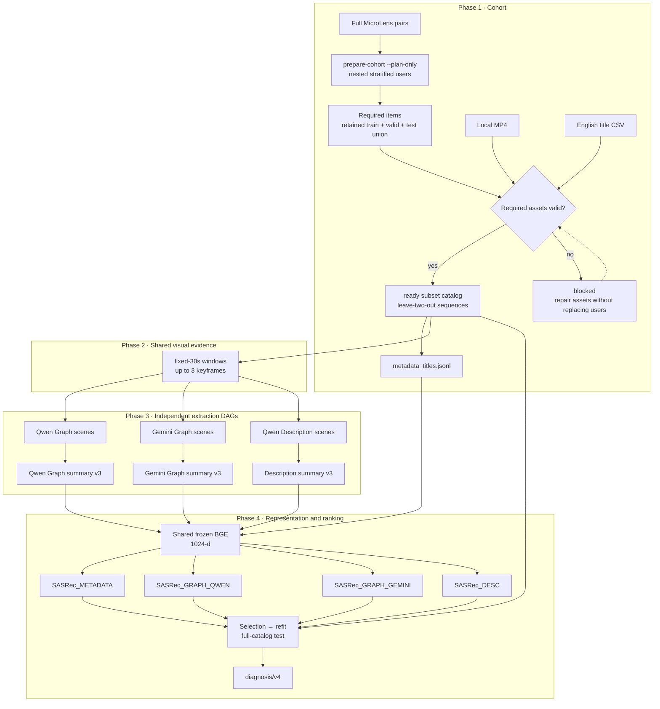

# ViewingContextPipeline

MicroLens-100K에서 **사용자를 먼저 선정해 추천 학습이 제대로 작동하는지 검증**하고, 동일한 행동 sequence의 item representation을 바꾸어 next-item ranking을 비교하는 visual Viewing Context PoC입니다.

기본 목표는 **user-1K**이며 영상 수를 1,000개로 제한하지 않습니다. 필요한 영상은 선정된 사용자들의 보존된 train·valid·test sequence에서 결정됩니다. 동일 원본 pairs와 선정 조건이면 user-1K ⊂ user-10K ⊂ user-100K로 확장할 수 있습니다.

검증 범위는 코드, CLI, schema, artifact lifecycle과 별도 Torch 학습 smoke입니다. 이 사용자 중심 protocol로 실제 MicroLens 입력의 GPU/Qwen·Vertex/Gemini·BGE·SASRec 11단계를 완주한 새 pilot은 이번 구현에 포함되지 않습니다. 사용자 증가가 성능 개선을 보장하지 않으며, 구현 검증만으로 추천 품질, CTR, watch time, 만족도, 제품 효과, 인과효과 또는 VLM의 일반적 우열을 주장하지 않습니다.

## 이 PoC가 답하려는 질문

- Creator-written English title을 사용한 `SASRec_METADATA`보다 visual Graph/Description representation이 이 protocol에서 유용한가?
- 제약된 `minimal-semantic-v2` Graph가 자연어 Description에 비해 선언된 ranking utility를 보존하는가?
- 동일 Graph prompt를 사용해도 Qwen과 Gemini extractor source에 따라 downstream 결과가 달라지는가?

이 연구는 [Describe What You See](<docs/Describe What You See Paper.pdf>)의 정확 재현이 아닙니다. 논문의 전체 데이터, global rolling split, 전체 영상을 1 FPS로 입력한 multimodal caption 조건 대신 선정 사용자 subset, leave-two-out, visual-only fixed-30s 조건을 사용합니다. 기존 item-1K pilot은 과거 실험으로 보존하며 새 protocol과 결과를 혼용하지 않습니다.

## 현재 파이프라인



Qwen Graph, Gemini Graph, Description은 서로 독립적인 extraction DAG입니다. 저장소에는 이들을 자동으로 묶어 실행하거나 downstream을 자동 무효화하는 tracked full-run runner가 없습니다.

| Arm | BGE 입력 | Scene extractor | 역할 |
| --- | --- | --- | --- |
| `SASRec_METADATA` | Creator-written English title | 없음 | Primary conventional baseline |
| `SASRec_GRAPH_QWEN` | Qwen Graph의 7-field summary | Qwen 2B | TV on-device VLM 제약을 근사한 Graph arm |
| `SASRec_GRAPH_GEMINI` | Gemini Graph의 7-field summary | Gemini | Extractor-source 민감도를 보는 exploratory Graph arm |
| `SASRec_DESC` | Qwen Description의 7-field summary | Qwen 2B | Graph와 자연어 정보 표현을 비교하는 arm |

모든 arm의 행동 sequence와 join key는 item ID입니다. Metadata/Graph/Description은 sequence를 video scene으로 바꾸는 것이 아니라, sequence 각 위치에 연결되는 item vector를 바꿉니다.

## 왜 이렇게 설계했는가

아래의 “통제 의도”는 실험 설계 이유이지, 현재 코드 검증만으로 입증된 결과가 아닙니다.

| 설계 선택 | 현재 구현과 통제 의도 | 남는 한계 |
| --- | --- | --- |
| `visual_only` | VC extraction에서 시각 신호를 격리합니다. | Multimodal 성능 주장이 아니며 Metadata title baseline은 이 modality의 예외입니다. |
| 동일 `fixed_30s` evidence | Branch 간 입력 keyframe을 통제합니다. 완전한 30초 window는 10초 구간 midpoint인 `+5/+15/+25`를 사용하고 partial window는 최대 3장을 사용합니다. | 영상 전체 사건을 완전히 관찰한다는 뜻이 아닙니다. |
| Source-neutral Graph v2 prompt | Qwen/Gemini가 같은 [Graph prompt](config/prompts/graph_scene_v2.md)를 받아 extractor source 차이를 봅니다. | Qwen–Gemini 비교는 exploratory이며 일반 모델 우열 benchmark가 아닙니다. |
| Raw Graph + warning | JSON object는 변형·deduplication하지 않고 ontology 위반을 `semantic_warnings`에 남깁니다. | Warning이 많은 scene도 downstream에 포함되므로 warning rate를 함께 봐야 합니다. |
| 공통 summary budget | 세 VC branch가 동일한 7-field v3, field당 20 words, comma 최대 2개, 512-token 상한을 사용합니다. | Ontology와 upstream extraction 차이는 남고 공통 Qwen summarizer 편향도 가능해집니다. |
| 공통 frozen BGE | Metadata title과 세 VC summary를 같은 `bge-large-en-v1.5` 1024-d 공간으로 인코딩합니다. | 같은 encoder가 representation의 모든 의미 차이를 공정하게 보존한다고 보장하지 않습니다. |
| 독립 content arms | 네 arm 모두 frozen feature를 512-d로 projection하며 ID embedding을 추가하지 않습니다. | VC의 incremental uplift가 아니라 standalone replacement 비교입니다. |
| 사용자 먼저 선정 | 원본 history 길이로 층화하고 하나의 seed 기반 순서에서 앞 N명을 고릅니다. 로컬 영상 보유 여부로 sequence를 필터링하지 않습니다. | Length-based 표본과 최대 13개 interaction 보존이라는 제약은 남습니다. |
| Selected-user subset catalog | 보존된 train·valid·test item 합집합 전체를 scoring합니다. 필요한 MP4/title 누락은 사용자 교체나 catalog 축소 없이 준비를 중단합니다. | “Full”은 이 subset 전체이지 MicroLens 전체가 아닙니다. 규모 확장 시 후보 catalog도 달라집니다. |
| Selection 후 refit | Train에서 학습하고 validation NDCG@10으로 epoch를 정한 뒤, 같은 seed의 새 모델을 train+valid target으로 정확히 그 epoch만큼 refit합니다. | User 수 증가만으로 학습 안정성이나 통계적 검정력을 보장하지 않습니다. |
| Actual-artifact diagnosis | Marker가 아니라 title, NPZ, scene outcome, metric grid, training history, checkpoint를 다시 읽습니다. | Provenance fingerprint를 대체하지 않으므로 의미 있는 입력 변경에는 새 `run_id`가 필요합니다. |

`SASRec`은 1024→512 trainable projection, item ReLU residual MLP, 2-block/2-head causal PreNorm Transformer, 2048 FFN, dropout 0.1, 마지막 유효 위치의 user GELU residual MLP를 사용합니다. Sequence는 right-padding하며 dot product로 full catalog를 scoring합니다. Train interaction frequency의 power 1.0으로 `logQ` correction을 적용하고, 같은 target의 다른 in-batch occurrence는 false negative가 되지 않도록 mask합니다. 이는 [MicroLens text SASRec 설정](https://raw.githubusercontent.com/westlake-repl/MicroLens/0fc876066987fb3b920df2765cfbac2763c515eb/Code/VideoRec/SASRec/run_text.py), [MicroLens loss 구현](https://raw.githubusercontent.com/westlake-repl/MicroLens/0fc876066987fb3b920df2765cfbac2763c515eb/Code/VideoRec/SASRec/model/model.py), [PinnerFormer](https://cs.stanford.edu/~jure/pubs/pinnerformer-kdd22.pdf)을 참고한 근사 구현이며 정확 재현으로 주장하지 않습니다.

> [직접 결정 필요] 실제 pilot 해석 전 `min_scene_coverage=0.95`, arm coverage gap `0.05`, partial summary 허용 여부, primary NDCG@10, non-inferiority margin `0.05`, comparison family와 multiplicity 정책을 승인해야 합니다. 현재 값은 provisional PoC 계약입니다.

## 실행 전 조건과 빠른 시작

- Python 3.11+와 conda 환경 `llmjg`
- `ffmpeg`, `ffprobe`가 `PATH`에 존재 (영상 검증·키프레임 생성 시; `--plan-only`에는 불필요)
- Linux/CUDA, Qwen checkpoint, 충분한 GPU memory (`Qwen` scene/summary pilot)
- Vertex ADC, project 권한, location, quota, 비용 승인 (`Gemini` branch)
- 원본 전체 `MicroLens-100k_pairs.tsv`: `user_id<TAB>space-separated item ids`
- 공식 `MicroLens-100k_title_en.csv`와 결측 title 보완용 공식 `MicroLens-50k_titles.csv`
- `data.titles_csv`가 가리키는 파생 `MicroLens-100k_title_en_completed.csv`: 각 줄을 첫 comma에서만 나눈 `positive item_id,title`; UTF-8 BOM 허용
- 양의 정수를 stem으로 갖는 local `{item_id}.mp4`
- `config/pipeline.yaml`의 data/model 경로가 실행 host에서 유효

```powershell
conda activate llmjg

# 코드·계약 검증
python -m pip install -e ".[dev]"

# 실제 extraction/recommendation profile
python -m pip install -e ".[qwen,gemini,train,dev]"
```

### 먼저 사용자와 필요한 영상 규모 확인

설정은 `config/pipeline.yaml`의 `data.pairs_tsv`와 `validation.cohort`에서 관리합니다. 기본값은 `user_count=1000`, `seed=42`, `min_sequence_length=5`, `max_sequence_length=13`, `history_strata=[5, 10, 20, 50]`입니다.

아래 Bash 예시는 영상·title 파일이 아직 없어도 전체 pairs만으로 실행할 수 있습니다. Torch/VLM이나 ffprobe를 실행하지 않습니다.

```bash
export RUN_ID=pilot_user1k_v3_YYYYMMDD
python -m validation prepare-cohort --run-id "$RUN_ID" --plan-only
```

`cohort_plan.json`, `selected_users.jsonl`, `required_items.jsonl`로 선정 결과를 고정하고 `eligibility_summary.json`에 `planned` 상태를 기록합니다. 설정 규모와 1K·10K·100K prefix별 필요한 영상 수, history 길이·절단 비율, train/refit interaction 수, 학습 단계별 미관찰 target 비율을 확인하십시오. 후보가 부족한 참고 규모는 `insufficient_candidates`이며, 설정한 목표 인원 자체가 부족하면 명령이 실패합니다. Duration을 모르는 단계의 scene/keyframe 수는 `null`이며 0이나 확정 비용으로 해석하지 않습니다.

공식 100K title 파일에는 빈 title이 일부 존재합니다. 선정 catalog에 빈 title이 포함되면 원본 파일을 수정하지 말고, 아래 준비 도구로 **현재 `required_items.jsonl`에 필요한 빈 값만** 공식 50K title에서 보완합니다. Primary의 비어 있지 않은 title은 항상 우선하며, supplement로도 해결되지 않은 required item이 있으면 출력 파일을 만들지 않고 실패합니다. 파생 CSV 옆의 `metadata-title-completion/v1` report에는 입력·출력 SHA-256과 보완 item ID가 기록됩니다. 이 명령은 11단계 밖의 데이터 준비 도구입니다.

```bash
ANNOTATIONS=/home_nvme/shared/data/microlens_100k/Annotations
wget -c \
  https://recsys.westlake.edu.cn/MicroLens-50k-Dataset/MicroLens-50k_titles.csv \
  -P "$ANNOTATIONS"

python -m validation.complete_titles \
  --primary "$ANNOTATIONS/MicroLens-100k_title_en.csv" \
  --supplement "$ANNOTATIONS/MicroLens-50k_titles.csv" \
  --required-items "artifacts/$RUN_ID/data/cohort/required_items.jsonl" \
  --output "$ANNOTATIONS/MicroLens-100k_title_en_completed.csv"
```

원본과 supplement는 [공식 MicroLens portal](https://recsys.westlake.edu.cn/)에서 받습니다. 50K supplement의 더 긴 문장·hashtag 스타일은 보완된 item에만 남으므로, Metadata arm 결과 해석 시 provenance report의 보완 규모를 함께 확인합니다. `data.titles_csv` 경로가 바뀐 기존 plan은 재사용하지 않고 새 `run_id`에서 `--plan-only`부터 시작합니다.

일반 `prepare-cohort`는 같은 선정 명세를 확인하고 필요한 MP4의 duration과 title coverage를 검증합니다. 전체 title CSV의 잘못된 item ID와 duplicate는 오류입니다. 필요한 title의 blank/missing은 `data/cohort/failures.jsonl`에 `missing_metadata_title`로 기록합니다. 필요한 영상 누락·손상도 기록하고 `blocked` 상태, exit code 1로 중단합니다. Catalog 밖의 blank title은 무시하지만, 필요한 item의 interaction 삭제·사용자 대체·fallback title은 하지 않습니다.

자산을 보완한 뒤 같은 명령으로 재개하십시오. 최종 catalog·sequence·title이 일치할 때만 마지막으로 `ready`를 기록합니다. 일반 `prepare-cohort`는 재실행 시에도 자산을 재검사합니다. 기존 최종 파일이 남아 있어도 `planned`/`blocked` 상태에서는 downstream이 실행되지 않습니다. 이미 `ready`인 run을 `--plan-only`로 확인해도 상태를 낮추지 않습니다.

<details>
<summary>중첩 선정 규칙과 user-10K / user-100K 확장</summary>

후보는 원본 interaction 수가 최소 길이를 만족하는 사용자입니다. 원본 history 길이로 층을 나누고 각 층에서 `(SHA256(seed:user_id), user_id)` 순으로 정렬합니다. 층 크기 `n`, 0-based 순번 `r`의 우선순위는 `(2r+1)/(2n)`이며, 정수 교차곱으로 비교해 모든 층을 병합합니다. 동률은 층의 하한과 사용자 ID로 정합니다.

하나의 순서의 앞 N명을 사용하므로 규모마다 quota를 다시 배분하지 않습니다. `cohort_rank`는 1-based 전역 선정 순번이고, 최종 학습 sequence 파일은 사용자 ID 순서입니다. 선정된 사용자의 마지막 최대 13개 interaction에서 마지막 두 개를 valid/test로 떼며, 반복 item과 원래 순서는 보존합니다.

10K·100K로 확장할 때는 원본 pairs·seed·길이 조건을 유지하고 `user_count`만 바꾸어 **새 run**을 만듭니다. 원본 item ID/content ID는 바뀌지 않지만 catalog row index는 각 run에서 다시 생성됩니다. 이전 run의 전체 cohort 폴더를 복사하지 않습니다.

</details>

## 11단계 실행

위 사전 계획 뒤 필요한 자산을 확보하고 같은 `RUN_ID`로 실행합니다. `--plan-only`는 1단계의 보조 모드이며 논리적 단계는 여전히 11개입니다. 아래 예시는 Bash입니다. PowerShell에서는 `$env:RUN_ID = "..."`로 설정하고 명령의 `$RUN_ID`도 `$env:RUN_ID`로 바꿉니다. v1/v2 config와 기존 item-1K cohort는 재사용하지 않으며 migration/compatibility alias는 없습니다.

```bash
# Phase 1 · cohort (1)
python -m validation prepare-cohort --run-id "$RUN_ID"

# Phase 2 · shared visual evidence (2)
python -m extraction prepare-input-data --run-id "$RUN_ID"

# Phase 3 · three independent extraction DAGs (3–8)
python -m extraction extract-graph-scenes --model qwen --run-id "$RUN_ID" --gpus 1
python -m extraction summarize-graph --source qwen --run-id "$RUN_ID" --gpus 1
python -m extraction extract-graph-scenes --model gemini --run-id "$RUN_ID"
python -m extraction summarize-graph --source gemini --run-id "$RUN_ID" --gpus 1
python -m extraction extract-description-scenes --run-id "$RUN_ID" --gpus 1
python -m extraction summarize-description --run-id "$RUN_ID" --gpus 1

# Phase 4 · representation, recommendation, diagnosis (9–11)
python -m validation embed-representations --run-id "$RUN_ID"
python -m validation run-recommendation --run-id "$RUN_ID"
python -m validation run-diagnosis --run-id "$RUN_ID"
```

Qwen은 `device_map=cuda`와 `bfloat16`을 사용하므로 `--gpus` 생략이 CPU 실행을 뜻하지 않습니다. 설정된 `batch_size=256`은 user sequence를 복제하는 값이 아닙니다. Batch마다 남아 있는 실제 사용자 sequence만 사용합니다.

기존 키프레임을 가져오려면 위 2단계 명령 **대신** 다음을 사용할 수 있습니다.

```bash
python -m extraction prepare-input-data --run-id "$RUN_ID" --reuse-run-id OLD_RUN_ID
```

필요한 content에 한해 donor inventory의 item/content ID, 영상 경로·크기·mtime·duration을 현재 값과 비교합니다. 현재 fixed-30s 계산과 동일한 timestamp, 정확한 PNG 이름 집합, Pillow 검증과 해상도가 모두 일치해야 복사합니다. 정보 누락·손상·불일치는 해당 content의 새 추출로 처리합니다. 기존 정상 target evidence가 우선이며 donor를 변경하지 않습니다. `--force` 또는 같은 run ID와 함께 사용할 수 없습니다.

이 옵션은 PNG와 timestamp만 가져옵니다. Graph/Description scene·summary·embedding·checkpoint는 재사용하지 않습니다. 검사에 필요한 inventory와 evidence가 있는 과거 item-1K run도 donor로 지정할 수 있지만, 이 metadata 검사가 cryptographic provenance를 증명하는 것은 아닙니다.

## 결과를 읽는 순서

`artifacts/{run_id}/validation/diagnosis/diagnosis.json`을 다음 순서로 해석합니다.

1. **Test pass**: Ruff/core/Torch profile이 구현 계약을 통과했는가?
2. **Runtime and coverage**: `runtime_decision.status`, `checks`, `errors`, `cohort`, `scene_coverage`가 실제 artifact의 완전성을 통과했는가?
3. **Statistical status and comparisons**: `statistical_analysis.status`, warnings, 선언된 여섯 비교를 해석할 수 있는가?
4. **External and product validity**: 이 protocol 밖의 사용자 경험이나 제품 지표로 일반화할 근거가 있는가?

Runtime이 실패하면 통계 결과를 해석하지 않습니다. `computed_with_warnings`는 계산 성공과 결론 가능성을 동일시하지 않습니다. Sparse Description control 때문에 conditional bootstrap만 가능하면 non-inferiority는 `not_evaluable_sparse_control`로 남습니다. `bootstrap resample has zero control mean` 오류도 숨기지 않습니다.

`cohort.statistics.selection`과 `cohort.statistics.refit`에서 interaction 수·고유 item 수·미관찰 target 비율을 구분해 읽습니다. 기존 metric의 `target_frequency_bucket`은 selection train 기준이며 refit 후 cold 비율과 같지 않을 수 있습니다. 4개 arm × 3개 seed의 학습 loss, best epoch, refit history와 seed별 concentration도 함께 확인하십시오.

모든 arm은 **같은 규모 안에서** 동일 사용자·split·catalog를 사용합니다. 1K와 10K는 후보 catalog도 달라지므로 절대 NDCG 차이를 사용자 증가만의 효과로 해석하지 않습니다. 여기서 full-catalog scoring은 선정 사용자 subset의 전체 catalog이며 MicroLens 전체 catalog가 아닙니다.

Diagnosis의 비교 family는 다음과 같습니다.

| Family | 비교 | 역할 |
| --- | --- | --- |
| `metadata_baseline_superiority` | Graph Qwen, Graph Gemini, Description − Metadata | Confirmatory, Bonferroni 3개 |
| `graph_vs_description_non_inferiority` | Graph Qwen/Graph Gemini − Description | Confirmatory, Bonferroni 2개 |
| `qwen_vs_gemini` | Graph Gemini − Graph Qwen | Exploratory 1개 |

## Artifact, cache, 실패, 재실행

```text
artifacts/{run_id}/
├─ data/
│  ├─ cohort/
│  │  ├─ cohort_plan.json
│  │  ├─ selected_users.jsonl
│  │  ├─ required_items.jsonl
│  │  ├─ item_inventory.jsonl
│  │  ├─ catalog.jsonl
│  │  ├─ sequences.jsonl
│  │  ├─ metadata_titles.jsonl
│  │  ├─ eligibility_summary.json
│  │  ├─ failures.jsonl                       # unresolved asset failure가 있을 때만
│  │  ├─ preparation_failures.jsonl           # unresolved frame failure가 있을 때만
│  │  └─ source_assets/{content_id}/assets/timestamp_fixed_30s.json
│  └─ fixed_30s/resized_keyframes/{content_id}/*.png
├─ extraction/
│  ├─ graph/{qwen,gemini}/
│  │  ├─ scenes/{content_id}.jsonl
│  │  ├─ scenes/failures/{content_id}.jsonl
│  │  ├─ summaries/{content_id}.json
│  │  └─ summaries/failures/{content_id}.jsonl
│  └─ description/
│     ├─ scenes/{content_id}.jsonl
│     ├─ scenes/failures/{content_id}.jsonl
│     ├─ summaries/{content_id}.json
│     └─ summaries/failures/{content_id}.jsonl
└─ validation/
   ├─ representations/
   │  ├─ item_index.json
   │  ├─ metadata_embeddings.npz
   │  ├─ graph_qwen_embeddings.npz
   │  ├─ graph_gemini_embeddings.npz
   │  └─ desc_embeddings.npz
   ├─ recommendations/
   │  ├─ per_user_metrics.jsonl
   │  ├─ training_runs.jsonl
   │  └─ checkpoints/seed_{seed}/{arm}/sasrec.pt
   └─ diagnosis/diagnosis.json
```

| 상황 | 조치 |
| --- | --- |
| 동일 계약의 중단·누락 | 같은 명령을 재실행합니다. 완료 content는 cache에서 재사용합니다. |
| Cohort가 `planned`/`blocked` | 필요한 영상/title을 보완하고 같은 `prepare-cohort`를 실행합니다. 선정 사용자는 바꾸지 않습니다. |
| 이전 run의 키프레임 재사용 | `ready` cohort에서 `prepare-input-data --reuse-run-id OLD_RUN_ID`를 사용합니다. 검사 실패 content는 새로 추출합니다. |
| Failure scene 재생성 | Extraction에 `--force` 후 summary → embedding → recommendation도 각각 `--force`, 끝으로 diagnosis를 재실행합니다. |
| 사용자 수·seed·원본 pairs·선정 조건 변경 | 새 `run_id`로 계획부터 생성합니다. `--force`로 기존 선정 명세를 덮어쓰지 않습니다. |
| Data/config/model/prompt/schema/protocol 변경 또는 legacy artifact | 새 `run_id`로 1단계부터 실행합니다. Migration/compatibility alias는 없습니다. |
| Diagnosis 재검사 | `run-diagnosis`를 그대로 재실행합니다. 실제 파일을 다시 읽고 기존 문서를 덮어씁니다. |

`--force`는 해당 단계만 재생성하며 downstream을 자동 무효화하지 않습니다. Manifest/fingerprint도 없으므로 “파일이 존재한다”는 사실이 provenance 일치를 뜻하지 않습니다.

Scene/summary failure JSONL은 append-only history가 아니라 현재 unresolved failure state입니다. 성공 retry 또는 완전한 cache reuse 뒤 stale·empty failure 파일은 제거됩니다. Scene 명령의 exit code 0은 stage가 계속 실행되었다는 뜻이며 모든 scene의 성공을 보장하지 않습니다. 성공 artifact와 failure artifact가 동시에 남을 수 있으므로 coverage는 diagnosis에서 확인합니다.

## Scene, summary, diagnosis 계약

<details>
<summary>Graph scene · outer 5 fields, inner minimal-semantic-v2</summary>

Outer row는 정확히 다음 다섯 필드입니다.

```text
scene_idx, keyframes, graph, parse_mode, semantic_warnings
```

Inner Graph는 `setting_context`, `entities`, `events`, `semantic_topics`, `affect`를 사용합니다. Entity에는 `local_id`, `name`, `salience`, `function`, `count`가 있고, event는 최대 4개, topic은 최대 3개입니다. `role`, `static_relations`, `affect.subject_ids`는 제거되었습니다.

Native JSON object를 우선 읽고 실패 시 deterministic syntax-only repair를 적용합니다. JSON object이면 entity 수가 많더라도 원문을 변형·축약·semantic deduplication하지 않습니다. Exact keys, enum, ID/reference, caps, count, function 제약 위반은 deterministic `semantic_warnings`에 기록하며 syntax parse/repair 실패만 scene failure입니다.

</details>

<details>
<summary>Description scene · exact 5 fields</summary>

```text
schema_version, content_id, scene_idx, keyframes, description
```

Description은 visible fact만 사용하고 story, intent, identity, demographics, purpose, audience, cultural context, OCR transcription을 금지합니다. Graph와 Description은 grounding 원칙은 공유하지만 prompt와 ontology는 동일하지 않습니다.

</details>

<details>
<summary>Video summary v3 · exact 7 labeled lines</summary>

```text
setting_and_environments: ...
main_characters_and_objects: ...
chronological_events: ...
relations: ...
visual_atmosphere: ...
visible_affect: ...
semantic_topics: ...
```

Prompt는 각 값을 한 줄의 자연스러운 문장, field당 최대 20 words, comma 최대 2개로 요구합니다. Parser는 첫 `:`에서만 나누고 label의 추가·누락·중복·순서 변경과 별도 prose를 거부합니다. 개별 값은 비어도 되지만 일곱 값 전체가 비면 실패합니다. 검증 뒤 `sections` dictionary와 canonical `text`로 저장되므로 BGE 입력 순서는 고정됩니다. v2, missing/extra field는 migration하지 않습니다.

</details>

주요 schema는 다음과 같습니다.

```text
viewing-context-config/v3
validation-config/v3
microlens-user-cohort-plan/v1
microlens-cohort-eligibility/v3
metadata-title-completion/v1
metadata-title/v1
scene-description/v1
graph-video-summary/v3
description-video-summary/v3
sasrec-training-run/v2
diagnosis/v4
```

`protocol.cohort_sampling=user_first_nested_stratified`, `protocol.catalog_scope=selected_user_sequence_union`을 고정합니다. `diagnosis/v4`는 선정 명세와 실제 sequence·required item·catalog의 정확한 일치, `ready` 상태, Metadata title/embedding coverage, 네 NPZ의 catalog order·shape·finiteness, 4 arm × 3 seed의 selection/refit record와 checkpoint, full-catalog metric grid, scene coverage를 실제 파일에서 재검사합니다.

## 운영과 문제 해결

### Qwen decoding과 summary failure

Summary는 누락 content를 batch 처리하고 content마다 한 번만 생성합니다. 자동 retry와 retry 전용 prompt는 없습니다. Validation failure 때만 `[Qwen_summary_*_fail]` 로그와 raw output을 콘솔에 표시하고 `summaries/failures/`에 기록합니다. 다음 실행은 완료 artifact를 재사용하고 실패·누락 content만 다시 처리합니다.

- `extraction.greedy_decoding: true`: `do_sample=false`
- `extraction.greedy_decoding: false`: 별도 fixed seed 없이 `temperature=0.2`, `top_p=0.8`, `top_k=20`
- `extraction.graph_repetition_penalty=1.05`: 로컬 Qwen Graph scene에 적용
- `extraction.description_repetition_penalty=1.0`: 로컬 Qwen Description scene에 적용 (1.0은 비활성)
- `extraction.summary_repetition_penalty=1.05`: Qwen Graph/Description summary에 공통 적용 (Graph source가 Gemini인 경우도 포함)

세 repetition penalty는 각각 `[1, 2]` 범위에서 독립적으로 설정합니다. Prompt token은 제외하고 생성된 token에만 적용하며, greedy/sampled decoding 모두 사용할 수 있습니다. Scene의 기존 greedy decoding은 유지합니다. Gemini Graph API 호출에는 적용하지 않습니다. JSON의 반복 key·ID·구두점도 영향을 받을 수 있으므로 penalty가 JSON 형식 준수를 보장하지는 않습니다. 값을 변경하면 기존 cache가 자동 무효화되지 않으므로 변경 전후 출력이 섞이지 않도록 새 `run_id`를 사용합니다.
- Graph/Description summary output 상한: 512 tokens

Prompt, decoding, model을 바꾼 실험은 새 `run_id`가 필요합니다.

### Qwen GPU는 동작하지만 로그·파일이 늦는 경우

Scene 결과는 callback이 돌아온 시점에 content-local artifact로 checkpoint됩니다. GPU generation이 아직 반환되지 않았다면 GPU utilization이 있어도 새 scene 로그와 파일 mtime이 멈춰 있을 수 있습니다. 완료 content만 cache reuse 대상이며 partial content는 다음 실행에서 content 단위로 다시 처리합니다. Qwen interrupt는 exit code 130을 사용하고 이미 저장된 artifact를 유지합니다.

### Gemini interrupt

Ctrl+C는 local wait와 pending task를 정리하지만 이미 Vertex에 전송된 요청의 원격 취소를 보장하지 않습니다. 비용·quota를 고려해 별도로 확인하십시오.

### Cache가 의심스러운 경우

Metadata title, summary, embedding, training record가 현재 config와 의미적으로 같은지 자동 판별하는 fingerprint는 없습니다. 의미 있는 입력 변경이면 cache를 고치려 하지 말고 새 `run_id`를 사용합니다.

## 검증 수준

Core profile은 Torch 학습을 제외한 계약을 검사합니다.

```powershell
conda activate llmjg
python -m ruff check .
python -m pytest -q --ignore=tests/validation/test_model.py
python -m compileall -q src tests
```

Torch profile은 skip 없이 별도로 통과해야 합니다. Projection/residual/initialization/causal padding, NumPy 기준 `logQ` loss, duplicate target mask, finite guard, 4 arm × 3 seed × 1 epoch selection/refit smoke와 12 checkpoint를 검사합니다.

```powershell
conda activate llmjg
python -c "import torch; print(torch.__version__)"
python -m pytest -q -m torch tests/validation/test_model.py
```

Core에는 100K 합성 사용자 중첩 선정, 자산 누락/resume, donor evidence 손상과 재추출, 가변 catalog의 mock 11단계 연결 검증이 포함됩니다. 합성 fixture와 CPU Torch smoke는 실제 데이터·GPU·Vertex pilot을 대체하지 않습니다.

실제 pilot 완료에는 새 user-1K `run_id`의 11단계, Linux GPU Qwen/BGE/SASRec, Vertex Gemini, runtime/coverage pass, statistical status와 warning 해석이 모두 필요합니다. 구현은 영상 downloader를 포함하지 않습니다.

> [직접 결정 필요] 계획 단계의 필요 영상 수와 자산 검증 뒤 scene 규모를 확인하여 GPU/Vertex 예산·실행 범위를 승인합니다. Provisional 통계·coverage 정책 승인 전에는 품질 결론을 내리지 않습니다.

## 설계 자료

- [2026-08-27 pipeline PNG snapshot](docs/design/ViewingContextPipeline_260827.png) — ID baseline을 포함한 과거 dated snapshot
- [Pipeline overview PPTX snapshot](docs/design/ViewingContextPipeline_Overview.pptx) — 과거 설계 자료
- [Describe What You See paper](<docs/Describe What You See Paper.pdf>)
- [Video-only prompt note](docs/DescribeWhatYouSee_prompt_video_only.md)
- [ItemRAG paper](<docs/ItemRAG Paper.pdf>)

현재 구현 구조의 source of truth는 위 Mermaid, `config/pipeline.yaml`, CLI help, artifact/schema 검사 코드입니다. Dated PNG/PPTX는 현재 DAG 계약으로 해석하지 않습니다.
