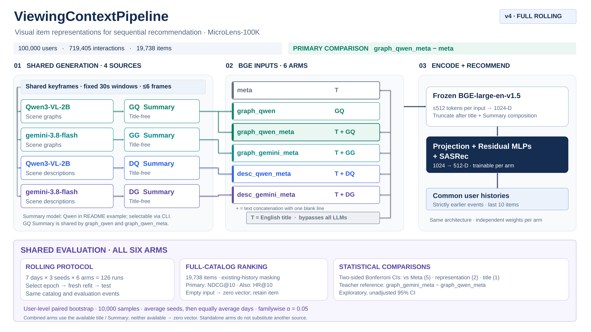

# ViewingContextPipeline



[다이어그램 PPTX 원본](docs/design/Diagram.pptx)

MicroLens-100K 영상에서 시청 맥락을 추출하고, 영문 제목에 시각 정보를 더했을 때 추천 성능이 어떻게 달라지는지 비교하는 실험 파이프라인입니다. Qwen·Gemini로 Graph와 Description을 생성하고, 동일한 사용자·후보 catalog·평가 구간에서 SASRec을 학습합니다.

## 실험 구성

실행은 `preparation → extraction → validation` 순서입니다. Validation에는 두 경로가 있습니다.

- **text**: Scene 관측을 제목 없이 요약하고, 제목 또는 Summary를 BGE로 임베딩합니다.
- **graph**: Scene Graph의 개체·행동·Context를 BGE 특징으로 준비한 뒤 Graph encoder와 SASRec을 함께 학습합니다. Summary는 필요하지 않습니다.

| 평가 Arm (`--target`) | text 입력 | graph 입력 |
| --- | --- | --- |
| `meta` | 영문 제목 | 영문 제목 |
| `graph_qwen` | Qwen Graph의 Summary | Qwen Scene Graph |
| `graph_qwen_meta` | 제목 + Qwen Graph의 Summary | 제목 + Qwen Scene Graph |
| `graph_gemini_meta` | 제목 + Gemini Graph의 Summary | 제목 + Gemini Scene Graph |
| `desc_qwen_meta` | 제목 + Qwen Description의 Summary | 미지원 |
| `desc_gemini_meta` | 제목 + Gemini Description의 Summary | 미지원 |

생성 소스(`--arm`)는 `graph_qwen`, `graph_gemini`, `desc_qwen`, `desc_gemini`입니다. 접미사는 **Scene 추출 모델**이며, Summary 모델은 `--model`로 따로 선택합니다. 생성에는 결합 Arm을 지정하지 않습니다. 평가에는 `--target`과 `--representation-mode`를 항상 명시합니다.

현재 모델(v5)은 **BGE small-en-v1.5 / 384차원만 지원**합니다. `meta`는 제목 384→Linear 512, Text는 제목 384→128 + Summary 384 직접 사용, Graph는 노드·Context 384→공유 Linear 128로 영상 384를 만든 뒤 제목 128과 결합합니다. 최종 LayerNorm 512와 SASRec·User MLP는 유지합니다. 결정성 강제는 기본 해제하며 seed는 고정합니다. [small 전환 및 서버 실행 안내](docs/graph_training.md#모델-v5-bge-small-전환과-state-lookup-최적화)를 참고하세요. [편집 가능한 PPTX](docs/design/recsys_diagram_small.pptx) · [PNG](docs/design/recsys_diagram_small.png)

주 비교는 `graph_qwen_meta − meta`입니다. Text 전체 평가는 기본 설정에서 7일 × 3 seed × 6 Arm입니다. 사용자 단위 paired bootstrap을 사용하며, seed 평균 후 날짜별 평균을 동일 가중치로 합칩니다. 현재 비교군은 제목 기준선 대비 5개, Graph/Description 비교 2개, 제목 추가 효과 1개이고 각 군에 Bonferroni 보정을 적용합니다. `graph_gemini_meta − graph_qwen_meta`는 별도의 탐색적 95% 구간입니다. 부분 target에서도 전체 비교군의 보정 분모를 유지합니다.

## 설치와 설정

Ubuntu/Bash와 Python 3.11 이상을 기준으로 합니다. 영상 준비에는 `ffmpeg`·`ffprobe`가 필요합니다. 데이터와 모델 가중치는 미리 준비해야 합니다.

```bash
python -m pip install -e ".[qwen,gemini,train,embedding,dev]"
python -m pip check
```

Gemini 생성만 실행하는 환경은 `.[gemini,dev]`, 임베딩·추천 환경은 `.[train,embedding,dev]`를 설치할 수 있습니다. Gemini는 Vertex ADC와 해당 프로젝트·모델의 호출 권한이 필요합니다. Qwen은 로컬 checkpoint와 vLLM을 사용합니다.

[config.yaml](config.yaml)을 환경에 맞게 수정합니다.

| 설정 | 내용 |
| --- | --- |
| `data.pairs_csv` | `user,item,timestamp` CSV. timestamp는 정수 밀리초 |
| `data.pairs_tsv` | 파일이 있으면 사용자별 interaction multiset을 CSV와 대조 |
| `data.videos_dir` | `{item_id}.mp4` 영상 디렉터리 |
| `data.titles_csv` | 영문 제목 원본 CSV |
| `data.titles_supplement_csv` | 필요한 아이템의 빈 제목·누락 행을 보완할 CSV. 선택 사항 |
| `models.qwen`, `models.bge` | 로컬 모델 디렉터리 |
| `models.gemini` | Vertex 프로젝트·위치·모델·생성 설정 |
| `extraction.{graph,description}.{qwen,gemini}` | 모델별 Scene·Summary 생성 토큰 한도 |
| `validation` | cohort 규모·평가 구간, BGE, 학습, 통계 설정 |
| `artifacts_root` | 산출물 상위 디렉터리 |

설정 형식의 `experiment_config_version: v4`와 실험 이름의 `v7`은 서로 다른 식별자입니다. Run 이름을 바꿀 때 설정 버전은 변경하지 않습니다.

이하 명령은 저장소 루트에서 실행합니다. Qwen·추천의 GPU 선택은 `CUDA_VISIBLE_DEVICES`로 지정합니다. 추천의 `--workers-per-gpu`는 GPU당 독립 학습 작업 수이며 기본값은 1입니다.

추천 학습의 세부 병목은 `run-recommendation`에 `--profile-every 100`을 추가해 측정할 수 있습니다. 배치별 Graph 준비·전송·인코딩·역전파와 평가 시간을 콘솔 및 조합별 `profile.jsonl`에 기록합니다. [측정 항목과 해석](docs/graph_training.md#추천-학습-병목-프로파일링)을 참고하십시오.

```bash
export RUN_ID=260928_v7
export CUDA_VISIBLE_DEVICES=0,1,2,3
```

## 입력 준비

```bash
python -m preparation prepare-cohort --run-id "$RUN_ID"
python -m preparation prepare-input-data --run-id "$RUN_ID"
```

`prepare-cohort`는 전체 interaction과 평가 구간을 준비하고, 필요한 영상·제목을 검사합니다. 보완 CSV를 지정하면 원본의 비어 있지 않은 제목을 우선하고 필요한 빈 제목·누락 행만 보완합니다. 끝내 해결되지 않은 제목은 빈 문자열로 저장합니다. 보완 CSV를 지정하지 않은 경우 누락 행은 오류입니다. 원본 CSV는 수정하지 않습니다.

`prepare-input-data`는 설정된 시간 창과 해상도로 keyframe을 준비합니다. 정상적인 기존 프레임은 재사용합니다. 목록과 평가 구간만 먼저 확인하려면 `prepare-cohort --plan-only`를 사용할 수 있지만, 다음 단계 전에 전체 `prepare-cohort`를 완료해야 합니다.

입력 준비 결과는 Run 간 공유됩니다. 데이터셋이나 평가 구성이 다른 실험은 `artifacts_root`를 분리합니다.

## Scene 추출과 Summary 생성

`--schema`에는 실제 존재하는 Markdown 프롬프트 파일 하나를 지정합니다. 상대 경로는 저장소 루트 기준입니다.

v8 Graph의 Actions는 `actor - action - target; tool; location`입니다. receiver는 출력·검증·Summary 및 직접 Graph 입력에서 제외합니다. 기존 파일은 수정하지 않으며, 완전한 v7의 6개 필드 형식과 기존 JSON은 receiver를 무시하고 읽습니다. 5개 필드 행의 마지막 값은 항상 location으로 해석하므로, location을 생략한 과거 v7의 불완전한 행은 자동으로 구별하지 않습니다. 새 실험에서는 새 Run에 아래 v8 프롬프트 쌍을 지정합니다.

```bash
python -m extraction extract-graph-scenes --run-id "$RUN_ID" --schema prompts/scene_graph_v8.md --model qwen --arm graph_qwen
python -m extraction extract-graph-scenes --run-id "$RUN_ID" --schema prompts/scene_graph_v8.md --model gemini --arm graph_gemini
python -m extraction extract-description-scenes --run-id "$RUN_ID" --schema prompts/scene_description_v3.md --model qwen --arm desc_qwen
python -m extraction extract-description-scenes --run-id "$RUN_ID" --schema prompts/scene_description_v3.md --model gemini --arm desc_gemini
```

Text 평가에는 선택한 소스의 Summary를 생성합니다. 아래 예시는 네 소스 모두 Gemini로 요약합니다. Qwen 요약을 실행하려면 `--model qwen`을 지정합니다.

```bash
python -m extraction summarize --run-id "$RUN_ID" --schema prompts/summary_graph_v8.md --model gemini --arm graph_qwen
python -m extraction summarize --run-id "$RUN_ID" --schema prompts/summary_graph_v8.md --model gemini --arm graph_gemini
python -m extraction summarize --run-id "$RUN_ID" --schema prompts/summary_description_v5.md --model gemini --arm desc_qwen
python -m extraction summarize --run-id "$RUN_ID" --schema prompts/summary_description_v5.md --model gemini --arm desc_gemini
```

제목은 LLM 입력에 넣지 않습니다. Text embedding에서는 제목·Summary를 각각 BGE로 인코딩하고, 추천 모델에서 projection한 벡터를 결합합니다. Summary 프롬프트에는 `{scenes}`가 필요하며 `{english_title}`은 허용하지 않습니다. 같은 Run·소스에는 하나의 Summary 모델을 사용합니다. 모델을 바꾸려면 새 Run 또는 `--force`를 사용합니다.

[run_pipeline_v7.sh](run_pipeline_v7.sh)는 단계별 명령을 보관한 수동 실행 스크립트입니다. 기본 활성 명령은 **두 Graph 소스의 Gemini 요약**이며, 전체 파이프라인을 자동 실행하지 않습니다. 필요한 단계의 주석을 조정하거나 위 명령을 직접 실행합니다.

## 임베딩·추천·진단

### Text 평가

```bash
python -m validation embed-representations --run-id "$RUN_ID" --target meta graph_qwen graph_qwen_meta graph_gemini_meta desc_qwen_meta desc_gemini_meta --representation-mode text
python -m validation run-recommendation --run-id "$RUN_ID" --target meta graph_qwen graph_qwen_meta graph_gemini_meta desc_qwen_meta desc_gemini_meta --representation-mode text
python -m validation run-diagnosis --run-id "$RUN_ID" --target meta graph_qwen graph_qwen_meta graph_gemini_meta desc_qwen_meta desc_gemini_meta --representation-mode text
```

일부 Arm만 실행하려면 세 명령의 `--target` 목록을 줄입니다. 선택하지 않은 소스의 Summary는 요구하지 않습니다.

### 직접 Graph 평가

```bash
python -m validation embed-representations --run-id "$RUN_ID" --target meta graph_qwen graph_qwen_meta graph_gemini_meta --representation-mode graph
python -m validation run-recommendation --run-id "$RUN_ID" --target meta graph_qwen graph_qwen_meta graph_gemini_meta --representation-mode graph --scene-aggregation mean
python -m validation run-diagnosis --run-id "$RUN_ID" --target meta graph_qwen graph_qwen_meta graph_gemini_meta --representation-mode graph --scene-aggregation mean
```

Attention 평가에서는 추천·진단의 `mean`을 `attention`으로 바꿉니다. 입력 준비는 두 방식을 공유합니다. `bash script_graph_v7.sh`는 직접 Graph 입력 준비와 두 pooling 방식의 추천·진단을 순서대로 실행합니다. 추출·Summary 생성은 실행하지 않습니다. 모델과 결측 처리의 상세 내용은 [직접 Graph 학습](docs/graph_training.md)을 참고하세요.

## 산출물

```text
artifacts/
├── preparation/                    # 공유 cohort·영상 준비
│   ├── cohort/
│   ├── resized_keyframes/<width>_<height>/  # 예: 640_352
│   └── source_assets/
├── runs/<RUN_ID>/
│   ├── extraction/
│   │   ├── scenes/<source>/
│   │   └── summaries/<source>/
│   └── validation/
│       ├── cohort/
│       ├── representations/{text,graph}/
│       ├── recommendations/text/
│       ├── recommendations/graph/{mean,attention}/
│       └── diagnosis/
├── shared_cache/                   # 검증된 임베딩·Graph 입력·추천 결과
└── <RUN_ID>/reports/                # Run별 분석 코드·보고서·표·이미지
```

추천 결과는 날짜 × seed × Arm 단위로 checkpoint·학습 기록·이벤트별 지표·완료 manifest를 저장합니다. text 진단은 `text_diagnosis.json`, graph 진단은 `graph_mean_diagnosis.json` 또는 `graph_attention_diagnosis.json`입니다.

## 재개와 실패 대응

- **생성 재개:** 같은 명령을 재실행합니다. 성공 Scene·Summary는 프롬프트나 설정이 달라져도 재사용합니다. 성공 결과를 갱신하려면 해당 단계에 `--force`를 지정합니다.
- **실패 재시도:** Qwen은 설정된 repetition penalty 순서로 실패 항목만 처리합니다. Summary는 기록된 마지막 penalty 다음 값부터 재개하며, 마지막 값까지 실패한 항목은 Scene 입력이 복구되거나 `--force`를 사용할 때 다시 생성합니다. Gemini 실패는 재실행으로 재시도합니다.
- **생성 실패 확인:** Scene은 `scenes/<source>/failures/<content_id>.jsonl`, Summary는 `summaries/<source>/failures.jsonl`을 확인합니다. 실패 Summary는 빈 텍스트로 저장합니다.
- **결측 입력:** text 결합 Arm은 제목 또는 Summary 중 있는 값을 사용합니다. 둘 다 없으면 영벡터입니다. 결측 때문에 아이템·interaction을 제거하지 않으며, 손상 파일과 잘못된 provenance는 오류로 처리합니다.
- **추천 재개:** 완료 조합을 검증하고 재사용합니다. 미완료 조합은 처음부터 다시 학습하며 epoch 중간 재개는 하지 않습니다.
- **캐시:** 현재 Run → 공유 캐시 → 새 계산 순서입니다. `--force`는 해당 단계의 로컬·공유 캐시 읽기를 우회합니다. Scene·Summary는 다른 Run에서 자동으로 가져오지 않습니다.

현재 지원 기준은 `260928_v7`의 산출물과 현재 설정입니다. 과거 Run의 파일은 보존하지만 과거 전용 설정·진단·변환 명령은 지원하지 않습니다. 저장 형식과 캐시 키·provenance 규칙은 [실행·저장 계약](docs/runtime.md)에 정리했습니다.

## 개발과 검증

```bash
python -m pytest -q
ruff check --config pyproject.toml src tests benchmarks
bash -n run_pipeline_v7.sh script_graph_v7.sh
```

테스트는 `tests/preparation`, `tests/extraction`, `tests/validation`, `tests/integration`으로 구성합니다. v7 대표 산출물 fixture와 리팩토링 전 해시, 생성 재개·캐시, 작은 CPU 학습, 문서·스크립트 명령을 검증합니다. 실제 모델/API 호출과 전체 GPU 실험은 별도로 수행합니다.

입력 준비는 `preparation`, 생성과 결과 저장은 `extraction`, 표현 구성·추천·진단은 `validation`이 담당합니다. 공통 파일 입출력과 해시는 `artifact_io`, 모델·생성 출처 정규화는 `model_provenance`, 현재 Arm 정의는 `arm_registry`에 있습니다. 향후 실험 항목은 [프로젝트 이정표](docs/TODO.md)를 참고하세요.
